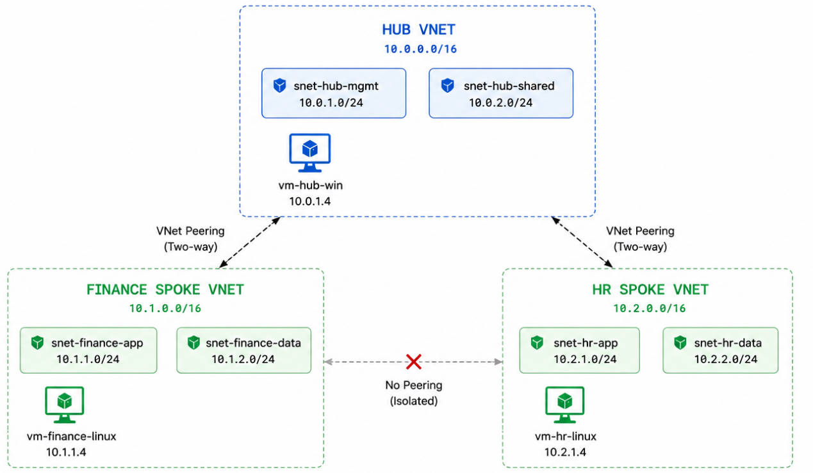
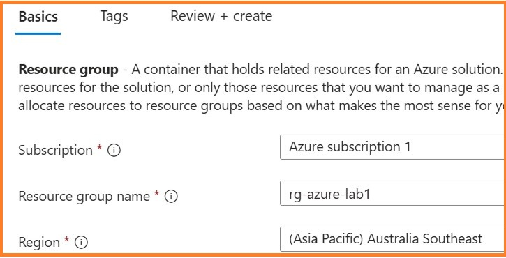
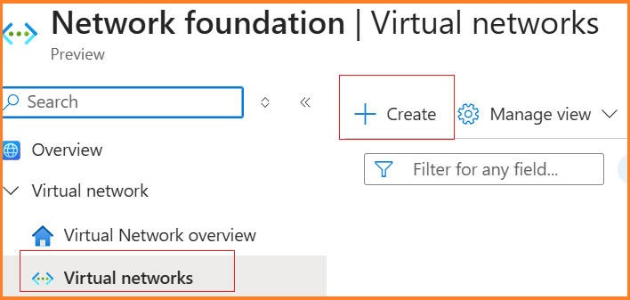
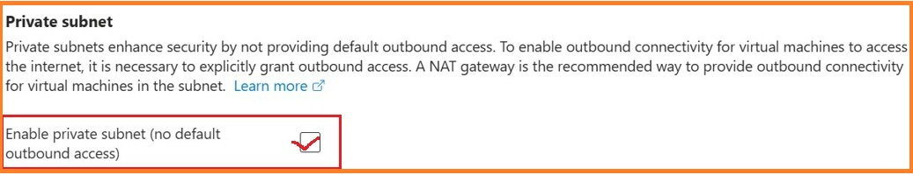
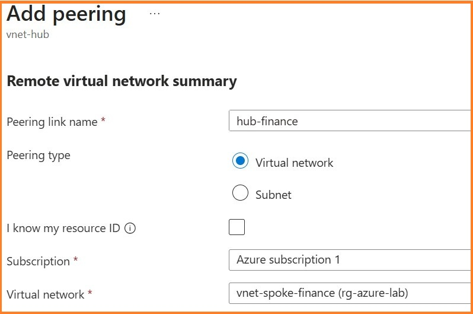
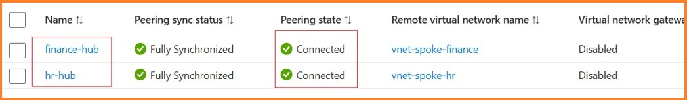
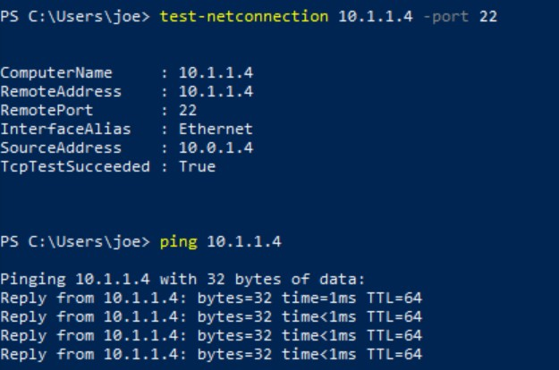

# Build Hub-Spoke Virtual Network Infrastructure

This section describes the first stage of the Azure Hub-Spoke Network Lab. The objective is to build the base network foundation, including the resource group, virtual networks, subnets, virtual machines and VNet peering connections.

This section focuses on the initial network deployment only. Security services such as Azure Firewall, Bastion, VPN Gateway, NSG and routing controls will be configured in later sections.



---

## Design Parameters

### Resource Group

| Component      | Name           | Region         |
| -------------- | -------------- | -------------- |
| Resource Group | `rg-azure-lab` | Australia East |

### Virtual Networks

| VNet                 | Address Space | Purpose                                   |
| -------------------- | ------------- | ----------------------------------------- |
| `vnet-hub`           | `10.0.0.0/16` | Central hub network for shared services   |
| `vnet-spoke-finance` | `10.1.0.0/16` | Finance department workload spoke network |
| `vnet-spoke-hr`      | `10.2.0.0/16` | HR department workload spoke network      |

### Subnets

| VNet                 | Subnet Name           | Address       | Purpose                    |
| -------------------- | --------------------- | ------------- | -------------------------- |
| `vnet-hub`           | `subnet-hub-mgmt`     | `10.0.1.0/24` | Management workload        |
| `vnet-hub`           | `subnet-hub-shared`   | `10.0.2.0/24` | Shared services subnet     |
| `vnet-spoke-finance` | `subnet-finance-app`  | `10.1.1.0/24` | Finance application subnet |
| `vnet-spoke-finance` | `subnet-finance-data` | `10.1.2.0/24` | Finance data subnet        |
| `vnet-spoke-hr`      | `subnet-hr-app`       | `10.2.1.0/24` | HR application subnet      |
| `vnet-spoke-hr`      | `subnet-hr-data`      | `10.2.2.0/24` | HR data subnet             |

---

### Virtual Machines

| VM Name            | VNet                 | Subnet               | Private IP | Public IP | Purpose             |
| ------------------ | -------------------- | -------------------- | ---------- | --------- | ------------------- |
| `vm-hub-win`       | `vnet-hub`           | `subnet-hub-mgmt`    | `10.0.1.4` | No        | Hub management VM   |
| `vm-finance-linux` | `vnet-spoke-finance` | `subnet-finance-app` | `10.1.1.4` | No        | Finance workload VM |
| `vm-hr-linux`      | `vnet-spoke-hr`      | `subnet-hr-app`      | `10.2.1.4` | No        | HR workload VM      |

- All vms uses ***Entra ID credential*** for user sign-in

---

### VNet Peering

| Peering                           | Direction | Purpose                      |
| --------------------------------- | --------- | ---------------------------- |
| `vnet-hub` ↔ `vnet-spoke-finance` | Two-way   | Connect Finance spoke to Hub |
| `vnet-hub` ↔ `vnet-spoke-hr`      | Two-way   | Connect HR spoke to Hub      |

There is no direct VNet peering between the Finance and HR spoke VNets. This keeps the two department networks isolated by default.

---

## Implementation Procdures

This stage includes the following tasks:

1. **Create the resource group**
   
       Azure Portal -> resource group-> create
   
   

2. **Create the Hub VNet / Finance Spoke VNet / Create the HR Spoke VNet**

```
    Azure Portal-> Virtual Networks -> Create
```

        vnet-hub: 10.0.0.0/16  
        vnet-spoke-hr: 10.1.0.0/16 
        vnet-spoke-finance: 10.2.0.0/16 



3. **Create hub and spoke subnets**
   
       Azure Portal-> Virtual Networks -> vnet-hub-> subnet-> create 
       
        subnet-hr-app: 10.1.1.0/24  
        subnet-hr-data: 10.1.2.0/24
       
        subnet-finance -app: 10.2.1.0/24  
        subnet-finance -data: 10.2.2.0/24  
       
        subnet-mgmt: 10.0.1.0/24  
        subnet-shared: 10.0.2.0/24
   
   - when creating the **spoke subnets**, remember to tick **enable Private subnet (no default outbound access)**. This removes default outbound Internet access for the spoke subnet. In later stages of this lab, Internet-bound traffic from the spoke subnets will be routed to the Azure Firewall in the Hub VNet, enabling centralized security inspection and policy impplimentation.
   
   

4. **Create three virtual machine**
   
        vm-hub-win1: 10.0.1.4 (in subnet-hub-mgmt)
        OS: Windows 10 enterprice
       
        vm-hr-linux1: 10.1.1.4 (in subnet-hr-app) 
        OS: Ubuntu Linux
       
        vm-fiance-linux: 10.2.1.4 (in subnet-finance-app) 
        OS: Ubuntu Linux
   
     When VMs were created, traditional authentication methods were selected.
   
     The **Linux VMs** were created with **SSH key** authentication  
     the **Windows 10 VM** was created with a local **username and password**. 
   
     This kept the initial deployment simple and ensured that the VMs could be accessed before Microsoft Entra ID login was configured.
    

5. **Configure Entra ID sign-in for VMs**


6. **Create VNet peering between Hub and Finance Spoke / Hub and hr spoke**



the status appeared connected after 2 hub-spoke peerings are established



7. Validate IP connectivity between Hub and each spoke
   
   After peering between hub and spoke vnet is established, use the powershell cmdlet ***test-connection*** and ***ping*** in the VMs to validate the peering.
   
   from vm-hub-win to vm-hr-linux
   
       ping 10.11.1.4
       
       test-connection 10.1.1.4 -port 22
   
   

At the end of this stage, the base Hub-Spoke network topology is ready. The spoke networks are connected to the Hub, but they are not directly connected to each other.
