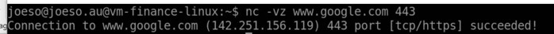
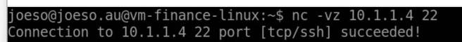
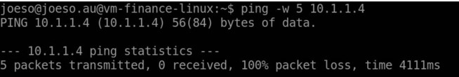
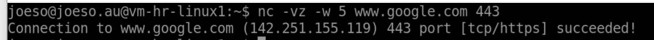
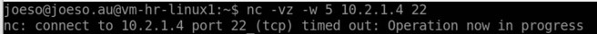
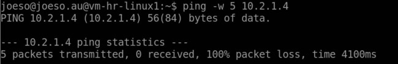

# 3. Centralized Network Security and Traffic Control (Firewall)

## 3.1 Overview

After establishing the Hub-Spoke network topology, the next step is to centralize network traffic control and security configuration using **Azure Firewall,** **User Defined Routes (UDR)** and **Network Security Groups (NSG)**.

Rather than allowing each spoke VNet to access the Internet independently, this lab routes outbound traffic through a **centralized Azure Firewall** deployed in the Hub VNet. 

​	Hub subnets => Hub Firewall => Internet

​	Spoke subnets => Hub firewall => Internet

Additionally, **all inter-spoke VNet traffic** is redirected to the firewall for centralized control and inspection before reaching its destination. In this lab, for test purpose, we only allow ***TCP 22*** traffics from finance VNet to HR VNet

​	Finance Spoke VNet => Hub Firewall => HR Spoke VNet

In this chapter, Azure Firewall is deployed in the Hub VNet. **User Defined Routes (UDRs)** are then configured to redirect outbound traffic from the spoke VNets to the firewall. Finally, **Firewall Policies** are
created to control Internet access and inter-spoke communication.

>

------------------------------------------------------------------------

## 3.2 Objectives

The objectives of this chapter are to:

-   Deploy Azure Firewall in the Hub VNet.
-   Centralize outbound Internet access.
-   Route spoke network traffic through Azure Firewall using User
    Defined Routes (UDRs).
-   Control Internet and inter-spoke communication using Firewall
    Policies.
-   Validate that all traffic is inspected before reaching its
    destination.

------------------------------------------------------------------------

## 3.3 Deploy Azure Firewall

Azure Firewall is deployed inside the Hub VNet. An Azure Firewall needs a dedicated
**AzureFirewallSubnet**. Here is the parameters for the Firewall subnet and firewall

| Resource           |               |
| ------------------ | ------------- |
| Firewall Subnet IP | 10.0.254.0/26 |
| Firewall IP        | 10.10.254.4   |
| Firewall SKU       | Standard      |

### 1）Create a Firewall Subnet in Hub VNet
The first step is to prepare a firewall subnet in Hub Vnet

IP address: 10.0.254.0/16

> 

### 2） Create an Azure Firewall (SKU Standard)
Then create an **Azure firewall** with the parameters shown in the screenshot

>   


A **public IP** is created for the firewall: ***pip-firewall-hub***

>  

------------------------------------------------------------------------

## 3.4 Configure User Defined Routes(UDR)

By default, Azure routes Internet-bound traffic directly to the Internet. To force traffic from all subnets to through Azure Firewall, We need to create User Defined Routes (UDRs) for each subnet.

### 1）create a route table for each subnet

Virtual networks -> Route Tables -> create 

### 2）Add the Internet-firewall route to the route table

we will add the following route (UDR) to the route table

​	**Destination**: 0.0.0.0/0  
​	**Next hop type**: Virtual appliance  
​	**IP**: 10.0.254.4  

#### - Destination: 
We use 0.0.0.0/0 as the destination for traffic to the Internet in this lab, because Azure automatically provides more specific routes for the **local VNet** and **peered VNets**. Therefore, traffic that does not match these internal routes falls to the default route `0.0.0.0/0`, which is typically Internet-bound traffic.

#### - Next Hope Type and IP:
By default, Azure routes Internet-bound traffic directly to the Internet using the built-in **Internet** as the next hop type. This means outbound traffic bypasses Azure Firewall, therefore,  we override Azure's default routing by creating  this UDR with next hope type **Virtual appliance** and the **Firewall internal address** 10.0.254.4 as the IP address

>

### 3）Add the Inter-spoke route (UDR) to the Route Table of each Spoke subnet

In order to redirect the defined inter-spoke traffics as following to go through Hub Firewall

```
TCP 22 traffic from Finance VNet (10.2.0.0/16) to HR VNet (10.1.0.0/16) 
```

We need to add a route in the route table of each subnet of Finance VNet

​	**Destination**: 10.1.0.0/16 (HR Spoke VNet)  
​	**Next hop type**: Virtual appliance  
​	**IP**: 10.0.254.4  

> 

### 4）Associate the route table to the relevant subnet

Route table is a independent Azure resource, we need to associate it to the relevant subnet after the creation. 
```
Route tables -> subnet -> associate
```
>

Once associated, all outbound traffic from the subnet is redirected to Azure Firewall in the hub before leaving the virtual network.

------------------------------------------------------------------------

## 3.5 Configure Firewall Policy

After traffic is redirected to Azure Firewall in the hub, we need to create **Firewall Policies** to determine whether the traffic should be permitted or denied.

Firstly，I found Azure Firewall organizes rules using a **three-level hierarchy**. This structure allows related rules to be grouped together, making firewall policies easier to manage.

Firewall Policy  
│  
└── Rule Collection Group  
      │  
      ├── Rule Collection  
      │      ├── Rule  
      │      ├── Rule  
      │      └── Rule  
      │  
      └── Rule Collection  
             ├── Rule  
             └── Rule   

#### Rule Collection Group

A Rule Collection Group is the highest level of rule organization within a Firewall Policy. It is primarily used to organize related rule collections and define the order in which they are processed.

#### Rule Collection

A Rule Collection contains rules of the **same type**, such as Network Rules or Application Rules. Each Rule Collection has a **single action**, either **Allow** or **Deny**. Allow and Deny rules cannot coexist within the same Rule Collection. If both actions are required, separate Rule Collections must be created

#### Rule

A Rule defines the actual traffic matching conditions, including **source**, **destination**, **protocol** and **port**. When traffic matches a rule, the configured action is applied.

### Firewall Rules Used in This Lab

In order to accomplish the objectives of Internet bound flow control and the defined one-way Inter-spoke traffic, we defined the following rule collections

| Priority | Rule Collection                 | Purpose                                                      |
| -------- | ------------------------------- | ------------------------------------------------------------ |
| 110      | **rc-allow-finance-to-hr-ssh**  | Allows only the required SSH traffic from the Finance spoke to the HR VM. |
| 120      | **rc-deny-interspoke**          | Blocks all remaining traffic between the Finance and HR spoke VNets. |
| 150      | **rc-allow-spokes-to-internet** | Allows outbound Internet access from both spoke VNets.       |

Azure Firewall processes Rule Collections from the lowest priority number to the highest, so we designed the rule collections in this order

1) Check whether the traffic matches the specific SSH allow rule (from Finance to HR).
2) If not, check whether it is inter-spoke traffic and deny it.
3) If neither rule matches, allow outbound Internet traffic.

This design ensures that only explicitly permitted inter-spoke communication is allowed, while all other inter-spoke traffic is blocked. At the same time, both spoke VNets keep outbound Internet access through Azure Firewall.  


>


This is a common enterprise firewall rule design: specific allow rules first, general deny rules second, and general Internet access rules last. This prevents broad Internet rules from allowing traffic that should be denied.

------------------------------------------------------------------------

## 3.6 Configure VNet Peering for Inter-Spoke Communications

After configuring the Azure Firewall rules, outbound Internet access from all VNets is working correctly -- all Internet-bound traffic is redirected to Azure Firewall, then head to the Internet from the **firewall public IP address**. 

However, Inter-Spoke traffic from Finance to HR spoke VNets is still no-through and requires one more peering setting.

When traffic goes from the Finance spoke to the HR spoke through Azure Firewall, the traffic path is:

```
Finance Spoke
    ↓
Hub VNet / Azure Firewall
    ↓
HR Spoke
```

This is a **forwarded traffic**, because the destination of the traffic is not Hub Vnet.

- ### What is  forwarded traffic

In a VNet peering connection, **forwarded traffic** refers to traffic with destination **not the directly peered VNet**. Instead, the packet is sent to the peered VNet because the **next hop** is there (for example, Azure Firewall), and is then forwarded to other destination.

For example, in this lab:

```
Finance Spoke
    ↓
Hub VNet / Azure Firewall
    ↓
HR Spoke
```

The packet is first sent to the Hub VNet because the next hop is Azure Firewall. However, its final destination is the HR VNet rather than the Hub VNet. Therefore, this traffic is considered **forwarded traffic**.

By default, Vnet peering blocks all forwarded traffics. Therefore, to support the traffic flow **Finance → Hub Firewall → HR**, **Allow forwarded traffic** must be enabled only on the peering connections in this path.

#### 1. **Hub → Finance Peering**

Enable:

> **Allow 'vnet-hub' to receive forwarded traffic from 'vnet-spoke-finance'**

This allows the Hub VNet to accept forwarded packets arriving from the Finance spoke.

> 

#### 2. **HR → Hub Peering**

Enable:

> **Allow 'vnet-spoke-hr' to receive forwarded traffic from 'vnet-hub'**

This allows the HR spoke to accept packets forwarded by Azure Firewall.

> 

The design of this lab only allows **Finance-to-HR** communication, the reverse forwarding path is not required. Therefore, the opposite forwarding settings are intentionally left disabled, following the **principle of least privilege**.

Once this setting is enabled, traffic from Finance VNet can be forwarded to HR VNet through the hub firewall. Then with the firewall rules, only TCP 22 traffic can be forwarded from Finance VNet to HR Vnet finally. 

## 3.7 Validation

After the firewall, UDR and VNet peering configurations above are completed, we can verify the following:

- ### Internet access from both spoke virtual machines.

  From a spoke Linux VM, use ***nc-vz*** command  to connect to port 433 of google  to test internet connection
  ```
  	nc -vz www.google.com 433
  ```

  

  

- ### One-way Inter-spoke communication following the configured Firewall Policy.

  In our lab, only inter-spoke traffic of ***TCP 22 from Finance VNet to Hr VNet*** allowed. we use the following command to validate the setting

  From a Finance Linux use nc command to connect to HR Linux VM on TCP Port 22

  ```
  	nc -vz 10.1.1.4 22  (IP of HR Linux VM)
  ```

  

  Succeeded result indicates that TCP 22 connection is through from FInance Vnet to HR Vnet

  

  Then ping HR vm to test other traffics

  ```
  	ping 10.1.1.4
  ```

  

  The result is 100% lost. That means ICMP traffic from Finance VNet to HR VNet is not through.

  The reason is we only allow TCP 22 traffic, other traffics are blocked by the firewall policy and Route table configuration.

  

- ### Traffic blocked from HR VNet to Finance VNet

  by firewall rules and route table configuration, we blocked all traffics from HR VNet to Finance VNet.
  
  Now we do validation of the setting.
  
  First from HR Linux VM, we do the following test
  
  
  
  

  
  
  The result is: the HR Linux VM can access Internet, but any traffic to Finance failed. That means the inter-spoke traffic from HR Vnet to Finance Vnet are blocked. the objectives have been accomplished.

------------------------------------------------------------------------

## 3.8 Summary

Azure Firewall has been deployed as the central security appliance for the Hub-Spoke network. User Defined Routes redirect traffic from the spoke VNets to the firewall, while Firewall Policies determine whether traffic is permitted to continue to its destination.
