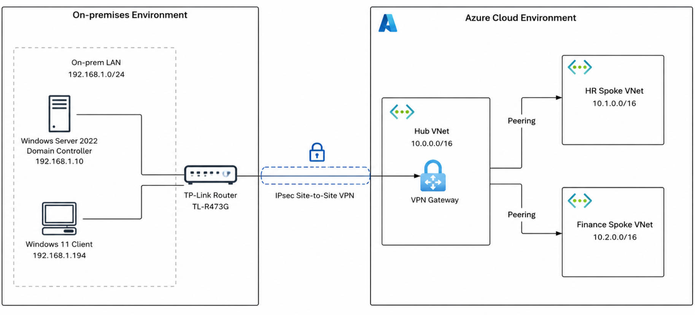
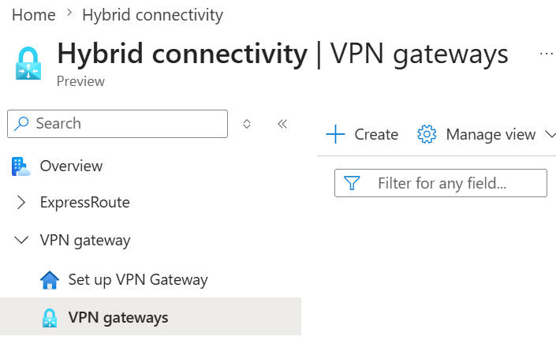
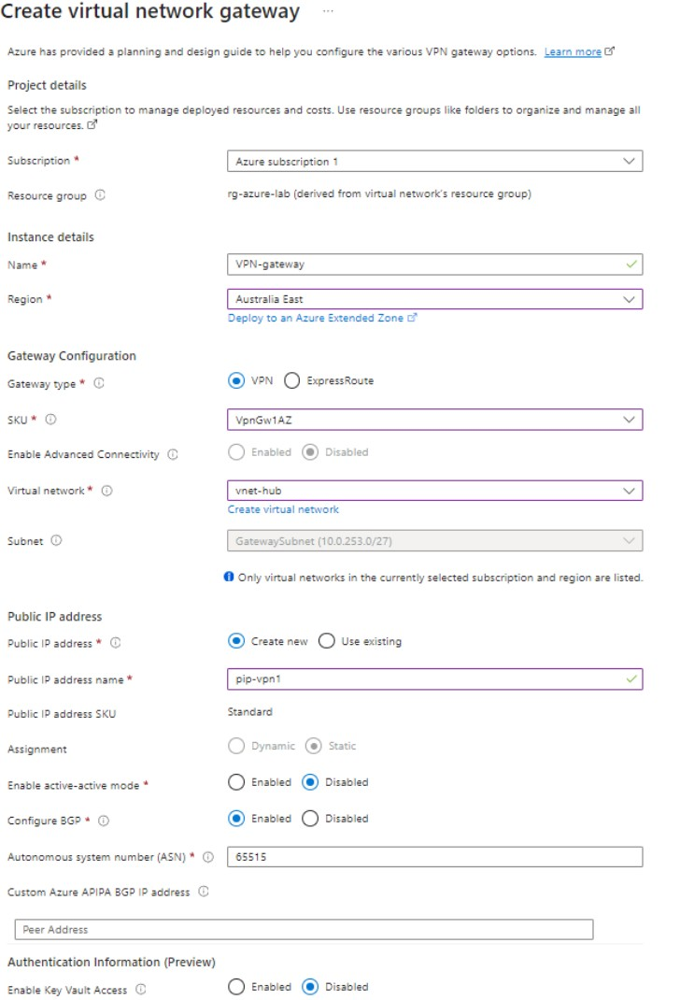
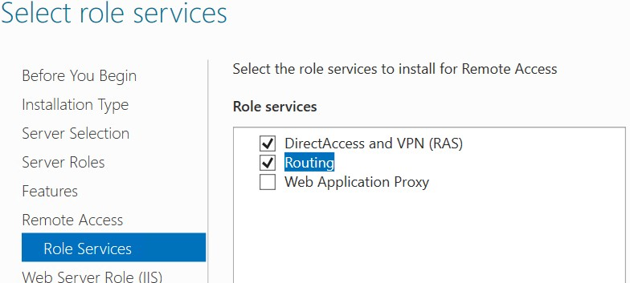
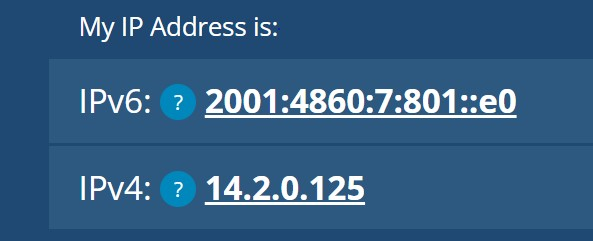
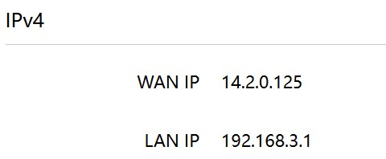
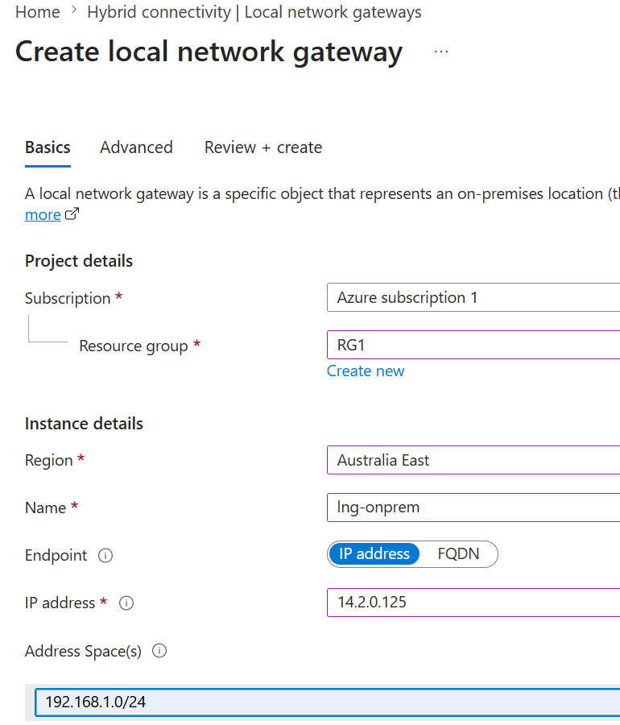

# 4. Hybrid Connectivity with Site-to-Site VPN

## 4.1 Overview

After implementing centralized network security, the next step is to establish hybrid connectivity between the on-premises network and Azure Cloud.

In this lab, a **Site-to-Site (S2S) VPN** will be established using **IPsec technology** between the on-premises and the Azure cloud. Instead of deploying separate VPN gateways in each spoke VNet, only **one VPN Gateway** is deployed only in the Hub VNet. The spoke VNets access the VPN connection through VNet peering and Gateway Transit, following the standard Hub-Spoke architecture.

## 4.2 Lab Environment

To simulate a typical enterprise hybrid cloud environment, this lab includes an on-premises network and an Azure Hub-Spoke network that we have established in previous stage.

The **on-premises** environment consists of:

-   Windows Server 2022 Domain Controller 192.168.1.10
-   Windows 11 client 192.168.1.194
-   On-prem LAN:  192.168.1.0/24
-   TP-Link Router : TL-R473G 

The **Azure Cloud** environment consists of:

-   Hub VNet 10.0.0.0/16
-   Finance Spoke VNet peered with Hub 10.2.0.0/16
-   HR Spoke VNet peered with hub 10.1.0.0/16

------------------------------------------------------------------------

## 4.3 Objectives

-   Deploy an Azure Virtual Network Gateway.
-   Configure the On-prem end point
-   Establish an IPsec Site-to-Site VPN tunnel.
-   Configure Gateway Transit.
-   Validate hybrid connectivity.

------------------------------------------------------------------------

## 4.4 Network Diagram

> 

------------------------------------------------------------------------

## 4.5 Deploy Azure Virtual Network Gateway

The first step to build the site-to-site VPN is to create the Azure Virtual Network Gateway in the Hub VNet.

1) ### Create a Azure Gateway subnet

​	To deploy an Azure Virtual Network gateway needs a independent subnet. Since we will deploy the 	gateway in the hub vnet, we create a new subnet in the hub vnet as following:

​	**Ip address**: 10.0.253.0/26

​	**Subnet type**: Gateway subnet

2) ### Create an Azure Gateway

   ```
   Azure Portal -> Hybrid Connectivity -> VPN gateway -> create
   ```

   

   > 

   Fill in the following parameters

​		**Name**: VPN-gateway

​		**SKU**: VpnGw1AZ

​		**Enable Active-Active Mode**: Disabled

​		**Public Ip Address**: create a new one -> **pip-vpn1: 20.227.109.199**

### Active-Active Mode VS Active-Standby Mode

Due to the Azure trial subscription being limited to a single public IP address for the VPN Gateway, this lab implements an **active-standby VPN** connection. In production deployments, an **active-active VPN** with two public IP addresses is commonly used to improve availability and better resilience against gateway failures. Therefore, we set the **Active-Active mode to Disabled** here


> ​	


------------------------------------------------------------------------

## 4.6 Prepare on-prem endpoint

- ### On-premises Network Design

The on-prem environment uses a Windows Server 2022 VM running **Routing and Remote Access Service (RRAS)** as the Site-to-Site VPN endpoint. This server establishes the IPsec tunnel with the Azure VPN Gateway and routes traffic between the local LAN and Azure VNets.

In a production environment, organizations typically use dedicated enterprise VPN routers or firewalls as the VPN endpoint. Since such hardware is not available in this lab, RRAS is used to provide equivalent routing and VPN functionality.

The local network connects to the Internet through a **TP-Link TL-R473G** router. Because the RRAS server is located behind the router on a private IP address (`192.168.1.10`), inbound VPN traffic from Azure cannot reach the RRAS server directly.

To allow Azure VPN Gateway to establish the IPsec tunnel, the TP-Link router is configured with **Virtual Server (Port Forwarding)** rules. These rules forward the required VPN traffic from the router's public IP address to the RRAS server.

The following ports are forwarded:

| Protocol | Port | Purpose                                  |
| -------- | ---- | ---------------------------------------- |
| UDP      | 500  | IKE (IPsec first stage )                 |
| UDP      | 4500 | IPsec NAT Traversal (IPsec second stage) |

1) ### Install RRAS in Windows 2022 Server

```
Server Manager → Add roles and features→ Role-based or feature-based installation→ Remote Access→ DirectAccess and VPN (RAS) + Routing→ Install
```

> 


2) ### Configure On-prem Internet Router

   Configure virtual Server （Port forwarding) in the on-prem Internet TP-Link Router

   > 


## 4.7 Create Local Network Gateway

After the basic configuration of the on-prem endpoint, we can create the Local Network Gateway representing the on-premises VPN enpoint in Azure endpoint, which is required in setting up the site-to-site VPN Connection.

1) ### Check the on-prem public IP 

​	We need the on-prem endpoint public IP to create the Local Network Gateway. To get the public IP by either way of following 

​	(1) from an on-prem computer, go to https://whatismyipaddress.com/, it will show your public IP address

> 

​	（2）check the public IP of the on-prem gateway router

> 


2) ### Create the Local Virtual Gateway

```	
Azure Portal -> Hybrid Connectivity -> Local Gateway -> create
```

input the **on-prem public address** and on-prem **private address space**


> 

------------------------------------------------------------------------


## 4.8 Create VPN Connection

Create the VPN connection between the Azure VPN Gateway and the Local
Network Gateway.

-   Connection type: Site-to-Site (IPsec)
-   Virtual Network Gateway
-   Local Network Gateway
-   Shared Key (PSK)

The same PSK must also be configured on the RRAS VPN router.

## 4.6 Configure Gateway Transit

Enable Gateway Transit so both spoke VNets can use the Hub VPN Gateway.

Hub: - Allow gateway transit

Spokes: - Use remote gateway

> **Insert:** Gateway Transit screenshots.


------------------------------------------------------------------------

## 4.9 Validation

Verify:

-   VPN tunnel status is Connected.
-   On-premises can reach Azure.
-   Finance and HR spokes can reach the on-premises network.
-   Gateway Transit works correctly.

> **Insert:** Validation screenshots.

------------------------------------------------------------------------

## 4.10 Summary

A Site-to-Site VPN has been established between the on-premises network
and Azure using IPsec. The VPN Gateway is centralized in the Hub VNet,
while Gateway Transit allows both spoke VNets to share the same VPN
connection.
