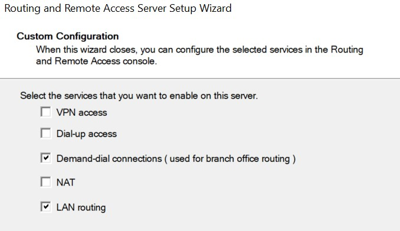
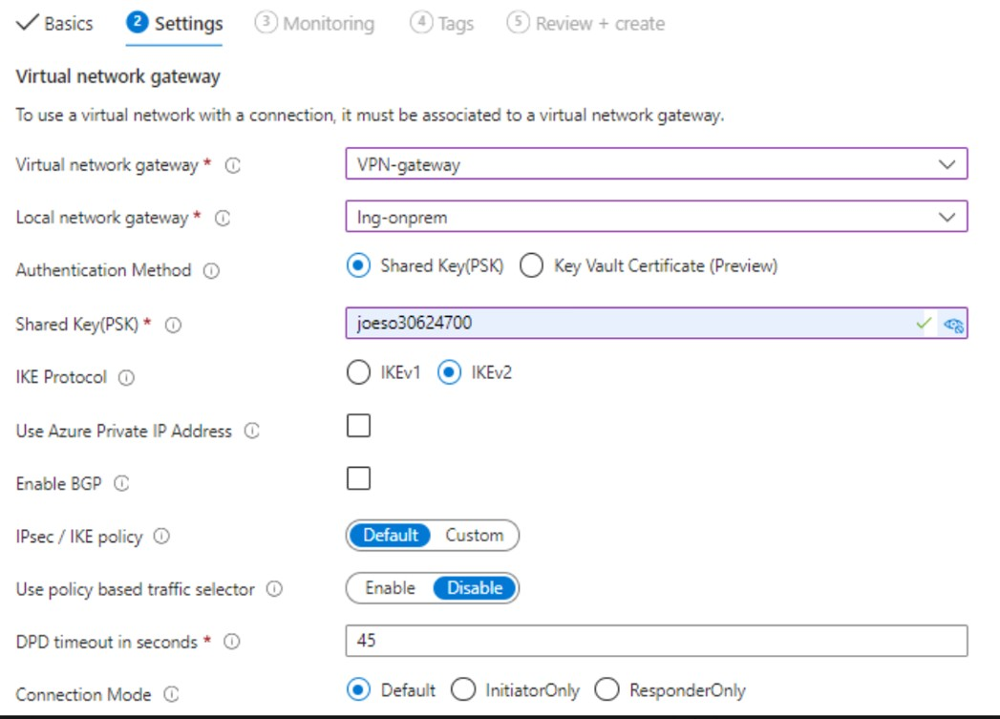
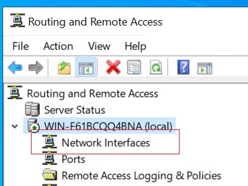
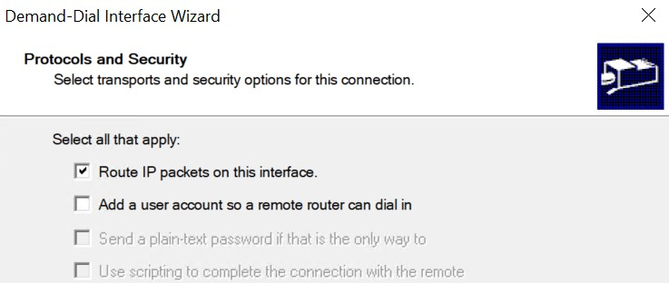
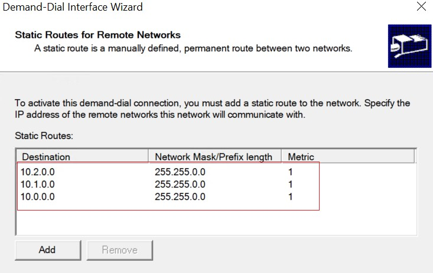
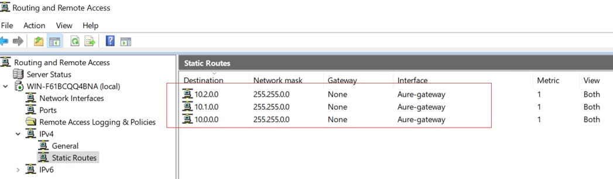
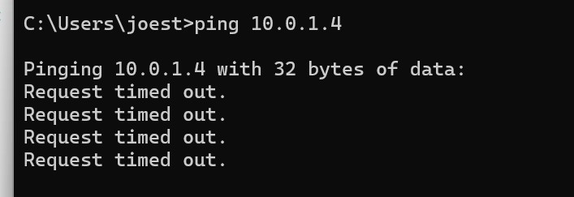
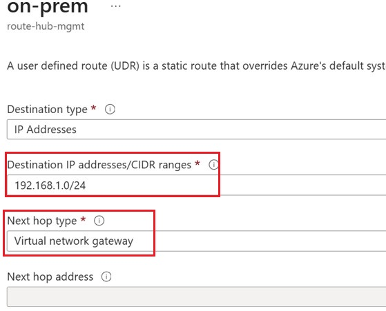
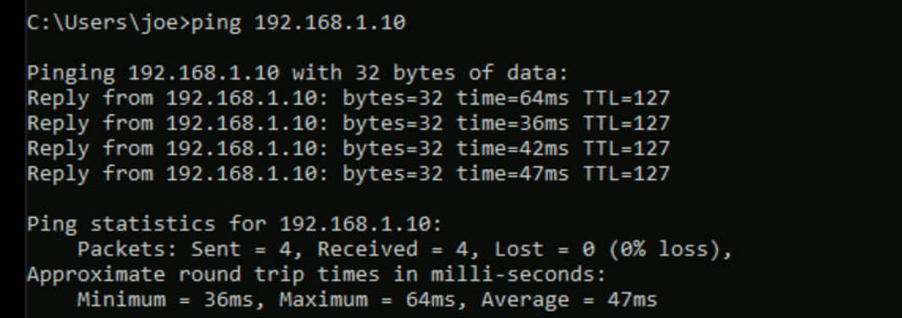

# 4. Hybrid Connectivity with Site-to-Site VPN

## 4.1 Overview

After implementing centralized network security, the next step is to establish hybrid connectivity between the on-premises network and Azure Cloud.

In this lab, a **Site-to-Site (S2S) VPN** will be established using **IPsec technology** between the on-premises and the Azure cloud. Instead of deploying separate VPN gateways in each spoke VNet, only **one VPN Gateway** is deployed only in the Hub VNet. The spoke VNets access the VPN connection through VNet peering and Gateway Transit, following the standard Hub-Spoke architecture.

## 4.2 Lab Environment

To simulate a typical enterprise hybrid cloud environment, this lab includes an on-premises network and an Azure Hub-Spoke network that we have established in previous stage.

The **on-premises** environment consists of:

-   Windows Server 2022 Domain Controller 192.168.1.10
-   Windows 11 client 192.168.1.194
-   On-prem LAN:  192.168.1.0/24
-   TP-Link Router : TL-R473G 

The **Azure Cloud** environment consists of:

-   Hub VNet 10.0.0.0/16
-   Finance Spoke VNet peered with Hub 10.2.0.0/16
-   HR Spoke VNet peered with hub 10.1.0.0/16

------------------------------------------------------------------------

## 4.3 Objectives

-   Deploy an Azure Virtual Network Gateway.
-   Configure the On-prem end point
-   Establish an IPsec Site-to-Site VPN tunnel.
-   Configure Gateway Transit.
-   Validate hybrid connectivity.

------------------------------------------------------------------------

## 4.4 Network Diagram

> 

------------------------------------------------------------------------

## 4.5 Deploy Azure Virtual Network Gateway

The first step to build the site-to-site VPN is to create the Azure Virtual Network Gateway in the Hub VNet.

1) ### Create a Azure Gateway subnet

​	To deploy an Azure Virtual Network gateway needs a independent subnet. Since we will deploy the 	gateway in the hub vnet, we create a new subnet in the hub vnet as following:

​	**Ip address**: 10.0.253.0/26

​	**Subnet type**: Gateway subnet

2) ### Create an Azure Gateway

   ```
   Azure Portal -> Hybrid Connectivity -> VPN gateway -> create
   ```

   

   > 

   Fill in the following parameters

​		**Name**: VPN-gateway

​		**SKU**: VpnGw1AZ

​		**Enable Active-Active Mode**: Disabled

​		**Public Ip Address**: create a new one -> **pip-vpn1: 20.227.109.199**

### Active-Active Mode VS Active-Standby Mode

Due to the Azure trial subscription being limited to a single public IP address for the VPN Gateway, this lab implements an **active-standby VPN** connection. In production deployments, an **active-active VPN** with two public IP addresses is commonly used to improve availability and better resilience against gateway failures. Therefore, we set the **Active-Active mode to Disabled** here


> ​	


------------------------------------------------------------------------

## 4.6 Prepare on-prem endpoint

- ### On-premises Network Design

The on-prem environment uses a Windows Server 2022 VM running **Routing and Remote Access Service (RRAS)** as the Site-to-Site VPN endpoint. This server establishes the IPsec tunnel with the Azure VPN Gateway and routes traffic between the local LAN and Azure VNets.

In a production environment, organizations typically use dedicated enterprise VPN routers or firewalls as the VPN endpoint. Since such hardware is not available in this lab, RRAS is used to provide equivalent routing and VPN functionality.

The local network connects to the Internet through a **TP-Link TL-R473G** router. Because the RRAS server is located behind the router on a private IP address (`192.168.1.10`), inbound VPN traffic from Azure cannot reach the RRAS server directly.

To allow Azure VPN Gateway to establish the IPsec tunnel, the TP-Link router is configured with **Virtual Server (Port Forwarding)** rules. These rules forward the required VPN traffic from the router's public IP address to the RRAS server.

The following ports are forwarded:

| Protocol | Port | Purpose                                  |
| -------- | ---- | ---------------------------------------- |
| UDP      | 500  | IKE (IPsec first stage )                 |
| UDP      | 4500 | IPsec NAT Traversal (IPsec second stage) |

1) ### Install RRAS in Windows 2022 Server

```
Server Manager → Add roles and features→ Role-based or feature-based installation→ Remote Access→ DirectAccess and VPN (RAS) + Routing→ Install
```

> 


```
Server Manager → Tools → Routing and Remote Access

Right click Server Name→ Configure and Enable Routing and Remote AccessCustom configuration → Tick LAN routing + Demand-dial connections → Finish → Start service
```

> 

2) ### Configure On-prem Internet Router

   Configure virtual Server （Port forwarding) in the on-prem Internet TP-Link Router

   > 


## 4.7 Create Local Network Gateway

After the basic configuration of the on-prem endpoint, we can create the Local Network Gateway representing the on-premises VPN enpoint in Azure endpoint, which is required in setting up the site-to-site VPN Connection.

1) ### Check the on-prem public IP 

​	We need the on-prem endpoint public IP to create the Local Network Gateway. To get the public IP by either way of following 

​	(1) from an on-prem computer, go to https://whatismyipaddress.com/, it will show your public IP address

> 

​	（2）check the public IP of the on-prem gateway router

> 


2) ### Create the Local Virtual Gateway

```	
Azure Portal -> Hybrid Connectivity -> Local Gateway -> create
```

input the **on-prem public address** and on-prem **private address space**


> 

------------------------------------------------------------------------


## 4.8 Create VPN Connection

Now, Both Azure cloud and on-prem endpoint infrastructures are prepared, we can create a IPsec Connection based on them.

1) ### On the Azure Cloud Endpoint
   Create a VPN Connection
   ```
   Under the virtual Network Gateway blade -> connections -> create
   ```

​	**Connection Name**:  VPN-Gateway

​	**Local Network Gateway**: lng-onprem

​	**Authentication method**: shared Key (PSK)

​	**IKE Protocol**: IKEv2

​	**Shared Key**: joeso30624700	

- in the lab, we used a preshared key for authentication which is still popular in current enterprise environment. 


> 


2) ### On-prem Endpoint
We need to use "**Demand Dial Interface**" from the RRAS Server to create **IPSec VPN connection** 

  ```
   Open RRAS -> Server Name -> Network Interface
   
   → New Demand-dial Interface : Give it a name like Azure-gateway
  	Connection type: VPN
  	VPN type: IKEv2
  	Destination address: 20.227.109.199 (Azure VPN Gate public IP Address)
  ```

>

  

Select `Route IP packets on this interface`

>

Add the private LAN Address spaces of the Azure Endpoint

```
10.0.0.0/16 → Hub
10.1.0.0/16 → HR Spoke
10.2.0.0/16 → Finance Spoke
```

>

After creation of the Interface, fill in the Shared Key for the IPsec Connection

```
Right click the interface -> properties ->security
-> tick "Use preshared key for authentication": joeso30624700
-> Type of VPN: IKEv2
-> Save
```


3. ### Do the connection from on-prem

   ```
   Right click Demand Dial Interface -> Connect
   ```

From the RRAS Admin tool, we can see the vpn is connected

>


```
RRAS -> Server -> IPv4 -> Static Route
```
We can see 3 routes have been added to the route table, which represent the 3 VNets of Azure Cloud Endpoint

```
10.0.0.0/16 → Hub
10.1.0.0/16 → HR Spoke
10.2.0.0/16 → Finance Spoke
```


>


## 4.9 Configure Route table of Hub Vnet of Azure end-point

Up to this point, the VPN tunnel is established between On-prem RRAS Server and Azure VPN gateway in the Hub Vnet.

However, if we ping the VM in the Hub VNet from the on-prem RRAS server

```
Ping 10.0.1.4
```

we will find it failed to go through

>

That is because the route table in the hub subnet is not yet configured for the route to the on-prem network through the VPN tunnel. As an result, VM in the Hub did not know where to send the response of the ping from on-prem server. we need to add a route in the route table the Hub mgmt subnet, where the VM is located. 

```
Route Name: on-prem
Destination Type: IP Address: 192.168.1.0/24  (ON-prem endpoint network address)
Next Hop Type: Virtual Netwrok gateway
```


> 


After the route to the on-premises network is in place, the Hub VM can successfully ping the on-premises VPN server: from hub VM

```
ping 192.168.1.10 （On-prem VPN Server)
```





## 4.9 Configure Gateway Transit for Spoke Vnet

Enable Gateway Transit so both spoke VNets can use the Hub VPN Gateway.

Hub: - Allow gateway transit

Spokes: - Use remote gateway

> **Insert:** Gateway Transit screenshots.


------------------------------------------------------------------------

## 4.9 Validation

Verify:

-   VPN tunnel status is Connected.
-   On-premises can reach Azure.
-   Finance and HR spokes can reach the on-premises network.
-   Gateway Transit works correctly.

> **Insert:** Validation screenshots.

------------------------------------------------------------------------

## 4.10 Summary

A Site-to-Site VPN has been established between the on-premises network
and Azure using IPsec. The VPN Gateway is centralized in the Hub VNet,
while Gateway Transit allows both spoke VNets to share the same VPN
connection.
