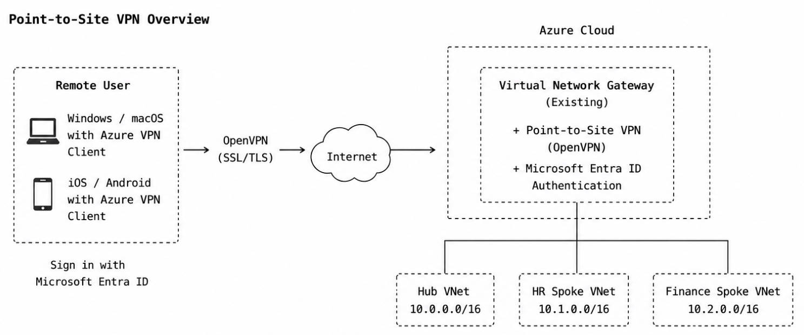
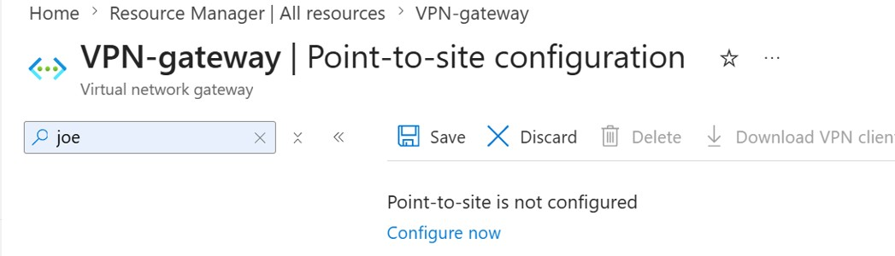
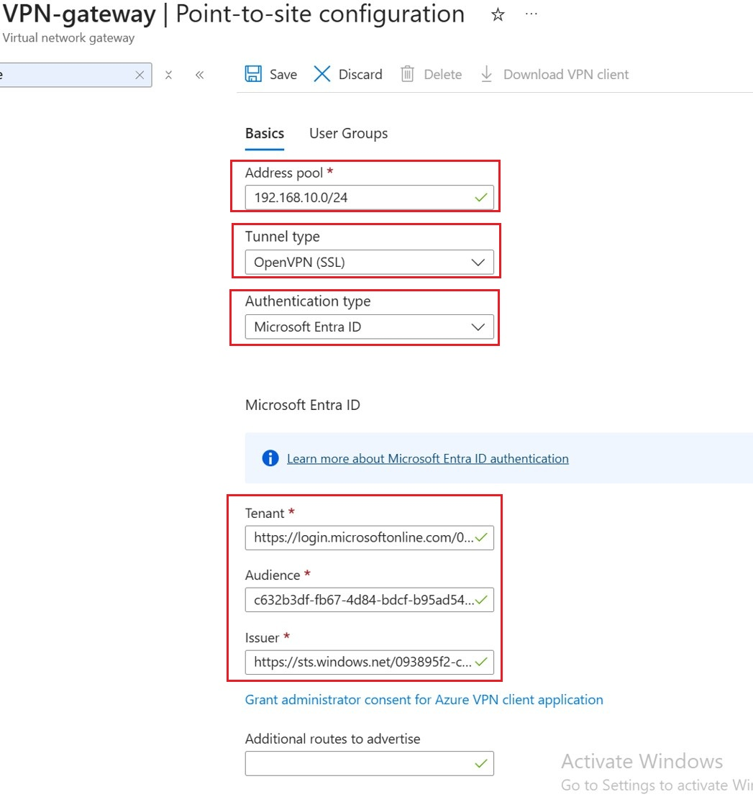

# 5. Remote User connectivity (Point-to-Site VPN)

## 5.1 Overview

The Point-to-Site VPN lab builds on the Site-to-Site VPN configuration completed in the previous lab. The existing Azure Virtual Network Gateway is reused to provide Point-to-Site (P2S) VPN access.

Unlike Site-to-Site VPN, which connects an entire on-premises network to Azure, Point-to-Site VPN is designed for individual remote users. It allows laptops and mobile devices to securely access Azure virtual networks from any location without requiring a permanent VPN routers.

In this lab, the Point-to-Site VPN connection uses the **OpenVPN protocol**, which is based on **SSL/TLS** **encryption**. OpenVPN is supported by **Azure VPN Client** and enables Microsoft **Entra ID authentication** for secure user access.

> 

### Why OpenVPN?

Azure Point-to-Site VPN supports multiple VPN protocols: **OpenVPN®**, **IKEv2**, **SSTP**.

\- **OpenVPN®** uses SSL/TLS encryption and supports Microsoft Entra ID authentication through Azure VPN Client.

\- **IKEv2** provides excellent performance but is primarily designed for certificate-based authentication and not support Microsoft Entra ID authentication.

\- **SSTP** is a legacy protocol supported only on Windows and provides limited cross-platform compatibility.

We select **OpenVPN** because it offers the best balance of security, compatibility and modern authentication.  OpenVPN supports **Microsoft Entra ID authentication**, allowing users to sign in with their Entra ID account instead of managing VPN certificates or local VPN accounts. Also, OpenVPN works across multiple operating systems and uses the **Azure VPN Client**, which is available for **Windows**, **macOS**, iOS and **Android**, allowing users to securely access Azure resources from **desktops**, **laptops** and **mobile devices**.


### Configure Point-to-Site VPN

### \- Azure Gateway side

The Azure Gateway side requires the following additional configuration:

- Enable Point-to-Site VPN on the existing Virtual Network Gateway.
- Configure the VPN client **address pool**.
- Configure the **OpenVPN tunnel protocol**.
- Configure Microsoft **Entra ID authentication**.

### \- Client side

The client side requires:

- Azure VPN Client
- VPN client profile
- Microsoft Entra ID sign-in

---

## 5.2 Azure Gateway Side Configuration

Since the Azure Virtual Network Gateway has already been deployed, only the Point-to-Site VPN settings need to be configured.

```
Enter the Virtual network gateway we created -> Point to Site Configuration -> configure Now
```

> 

- Address pool: **192.168.10.0/24**

- Tunnel type: **OpenVPN**
- Authentication type: **Microsoft Entra ID**
- Microsoft Entra Tenant: Enter our Microsoft Entra tenant URL
- Audience: Use the Azure VPN Client Application ID
- Issuer: Enter our tenant issuer URL

> 

After input the information above, click **download VPN Client**. This client will be used on client device to make point-to-site VPN connection to Azure Vnets

> 

---


## 5.3 Client Side Configuration

In the lab, we use Windows 11 as the Point-to-Site VPN client.

（1）Install **Azure VPN Client** on the Windows client

​	Install Azure VPN Client Using the installation file downloaded in the last step 

​	>

- Import the VPN client profile.
- Sign in using Microsoft Entra ID.
- Connect to Azure.

Because the VPN profile is generated by Azure, all required connection settings are imported automatically.

> **Insert:** Azure VPN Client screenshots.

---

## 5.5 Validation

After the VPN connection is established:

Verify:

- VPN status is **Connected**.
- The client receives an IP address from the configured VPN address pool.
- Azure virtual machines can be reached.
- Resources in the Hub, Finance Spoke and HR Spoke VNets are accessible.

> **Insert:** Validation screenshots.

---

## 5.6 Design Notes

This lab uses **Microsoft Entra ID authentication** together with **OpenVPN®** to provide secure remote access without managing local VPN user accounts or certificates.

Because the existing Azure Virtual Network Gateway supports both **Site-to-Site** and **Point-to-Site** VPN simultaneously, a single VPN Gateway can provide hybrid connectivity for branch offices while also supporting secure remote access for roaming users.

---

## 5.7 Summary

Point-to-Site VPN extends the existing hybrid network by allowing individual users to securely connect to Azure virtual networks from anywhere.

By reusing the existing Azure Virtual Network Gateway and integrating Microsoft Entra ID authentication with the OpenVPN® protocol, this solution provides secure, centralized and scalable remote access without requiring a dedicated VPN appliance.