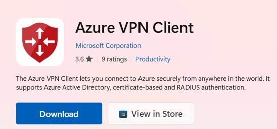
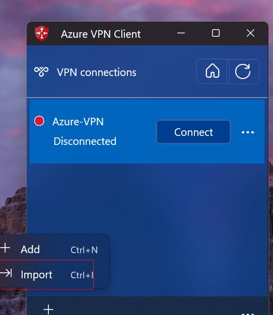
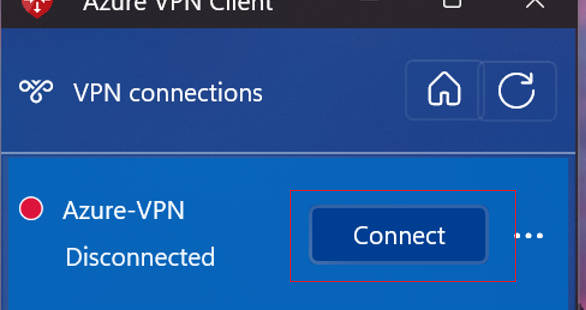
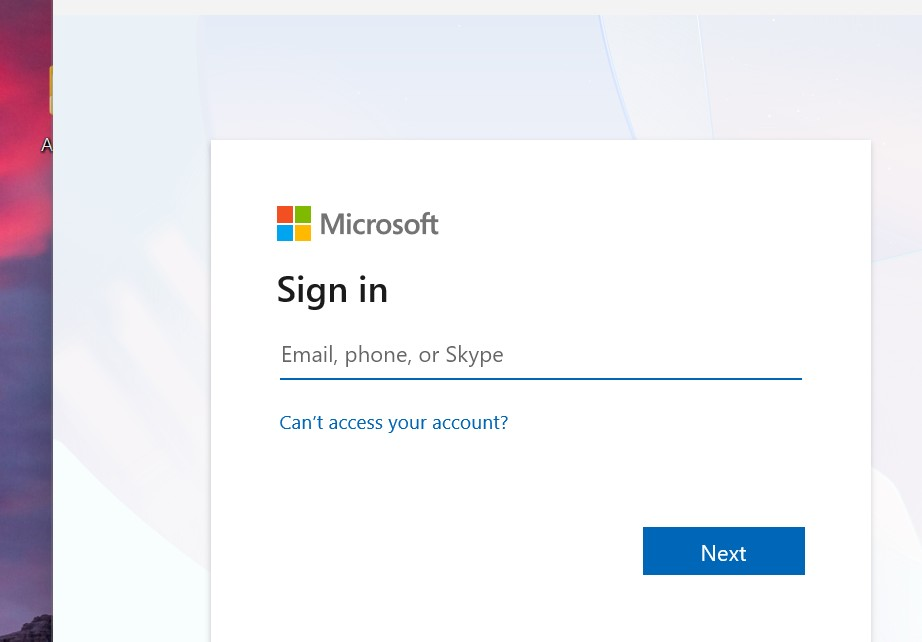
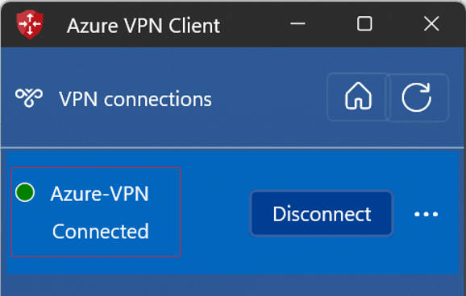
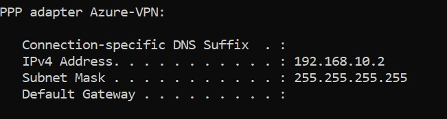
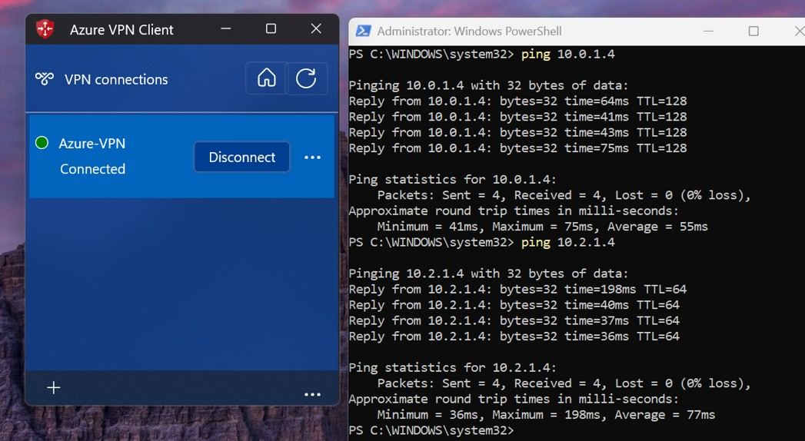

# 5. Remote User connectivity (Point-to-Site VPN)

## 5.1 Overview

The Point-to-Site VPN lab builds on the Site-to-Site VPN configuration completed in the previous lab. The existing Azure Virtual Network Gateway is reused to provide Point-to-Site (P2S) VPN access.

Unlike Site-to-Site VPN, which connects an entire on-premises network to Azure, Point-to-Site VPN is designed for individual remote users. It allows laptops and mobile devices to securely access Azure virtual networks from any location without requiring a permanent VPN routers.

In this lab, the Point-to-Site VPN connection uses the **OpenVPN protocol**, which is based on **SSL/TLS** **encryption**. OpenVPN is supported by **Azure VPN Client** and enables Microsoft **Entra ID authentication** for secure user access.

> 

### Why OpenVPN?

Azure Point-to-Site VPN supports multiple VPN protocols: **OpenVPN®**, **IKEv2**, **SSTP**.

\- **OpenVPN®** uses SSL/TLS encryption and supports Microsoft Entra ID authentication through Azure VPN Client.

\- **IKEv2** provides excellent performance but is primarily designed for certificate-based authentication and not support Microsoft Entra ID authentication.

\- **SSTP** is a legacy protocol supported only on Windows and provides limited cross-platform compatibility.

We select **OpenVPN** because it offers the best balance of security, compatibility and modern authentication.  OpenVPN supports **Microsoft Entra ID authentication**, allowing users to sign in with their Entra ID account instead of managing VPN certificates or local VPN accounts. Also, OpenVPN works across multiple operating systems and uses the **Azure VPN Client**, which is available for **Windows**, **macOS**, iOS and **Android**, allowing users to securely access Azure resources from **desktops**, **laptops** and **mobile devices**.


### Configure Point-to-Site VPN

### \- Azure Gateway side

The Azure Gateway side requires the following additional configuration:

- Enable Point-to-Site VPN on the existing Virtual Network Gateway.
- Configure the VPN client **address pool**.
- Configure the **OpenVPN tunnel protocol**.
- Configure Microsoft **Entra ID authentication**.

### \- Client side

The client side requires:

- Azure VPN Client
- VPN client profile
- Microsoft Entra ID sign-in

---

## 5.2 Azure Gateway Side Configuration

Since the Azure Virtual Network Gateway has already been deployed, only the Point-to-Site VPN settings need to be configured.

```
Enter the Virtual network gateway we created -> Point to Site Configuration -> configure Now
```

> 

- Address pool: **192.168.10.0/24**

- Tunnel type: **OpenVPN**

- Authentication type: **Microsoft Entra ID**

- Microsoft Entra Tenant: Enter our Microsoft Entra tenant URL

- Audience: Use the Azure VPN Client Application ID

- Issuer: Enter our tenant issuer URL

- **Additional routes to advertise**: 

  The **Additional routes to advertise** setting specifies which Azure VNet address spaces should be advertised to Point-to-Site VPN clients. When the VPN connection is established, Azure VPN Client automatically adds routes for these networks to the client's local routing table. This ensures that traffic destined for Azure VNets is sent through the VPN tunnel instead of the local Internet gateway.

  In this lab, we should configure the following routes:

  \- `10.0.0.0/16` (Hub VNet)
  \- `10.1.0.0/16` (HR Spoke VNet)
  \- `10.2.0.0/16` (Finance Spoke VNet)

> 

---


## 5.3 Client Side Configuration

In the lab, we use Windows 11 as the Point-to-Site VPN client.

### （1）Download and Install **Azure VPN Client** on the Windows client

​	

### (2) From the Azure Virtual Network Gateway Blade,  download VPN Client Profile. 

The Client profile is a XML file that store the parameters of the point-to-site client : **azurevpnconfig.xml**

>


### (3) Run the Azure VPN client in the Windows client computer, then import the client profile

>

>

```
Click Connect
```

>


- ### Sign in using Microsoft Entra ID.

  >

  

- ### Connected

  When Connected shows on the VPN Client windows, it means the Point-to-Site VPN connection is established.

>

---

## 5.5 Validation

After the VPN connection is established, we should verify:

- ### VPN status is **Connected**

  

- ### The client receives an IP address from the configured VPN address pool.

  the result of ipconfig command shows, the client computer receives ip address from the VPN Address pool: ***192.168.10.2***

  

- ### Azure virtual machines can be reached.
  from the client computer, 

  ping the VM in the Azure Hub Vnet ***10.0.1.4***

  ping the VM in the Finance Spoke Vnet ***10.2.1.4***
  
  Both ping are successful
  
  

---

## 5.7 Summary

Point-to-Site VPN extends the existing hybrid network by allowing individual users to securely connect to Azure virtual networks from outside the offices.

By reusing the existing Azure Virtual Network Gateway and integrating Microsoft Entra ID authentication with the OpenVPN protocol, this solution provides secure, centralized and remote access without requiring a dedicated VPN router.