# 06 - Secured Remote Administration - Azure Bastion

## 6.1 Overview

In the previous labs, the Azure Hub-Spoke network, Azure Firewall, Site-to-Site VPN and Point-to-Site VPN were configured to provide secure network connectivity between Azure resources, on-prem  offices and remote users.

Although administrators can now reach the Azure virtual network through a VPN connection, they still require a secure method to remotely manage individual VMs.

Traditionally, administrators connect directly to a VM using SSH (TCP 22) for Linux or Remote Desktop (TCP 3389) for Windows. This requires each VM to have a public IP address and ports exposed to the Internet.

Although we can restrict access, exposing ports is generally avoided in enterprise cloud environments because it increases the attack risks.

### - What is Azure Bastion

Azure Bastion is a **jump host service** for remote administration of Azure cloud VMs.

Instead of exposing management ports, administrators connect to the Bastion service, which then establishes the **RDP** or **SSH** session to the target VM over its private IP address.

Only the Bastion service has a public address. The VM remain completely private.

In this lab, **Azure Bastion Standard** is deployed to provide secure remote administration for both Windows and Linux VMs. The authentication method is also upgraded from local credentials and SSH keys to Microsoft **Entra ID authentication with Azure RBAC**.

---

## 6.2 Objectives

This chapter demonstrates how to:

- Deploy Azure Bastion Standard
- Configure Azure Bastion Native Client
- Upgrade VM authentication to Microsoft Entra ID
- Configure Azure RBAC VM login roles
- Configure Windows Entra ID login
- Configure Linux Entra ID login
- Connect to Windows and Linux VMs through Azure Bastion
- Validate secure administration without public IP addresses

## 6.3 Architecture
Azure Bastion will be deployed in the **Hub VNet** and serves as the central admin entry point for the entire Hub-Spoke network.

Although the Bastion resource resides only in the Hub VNet, it can serves VMs located in both the Hub and Spoke VNet through VNet peerings. As a result, only **a single Bastion host in the hub VNet** is needed. 

In this lab, a single Azure Bastion deployment provides secure access from remote computers to the following VMs:

- Hub Windows VM
- HR VNet Linux VM
- Finance VNet  Linux VM

No VPN connection or public IP of the VM is needed.

> 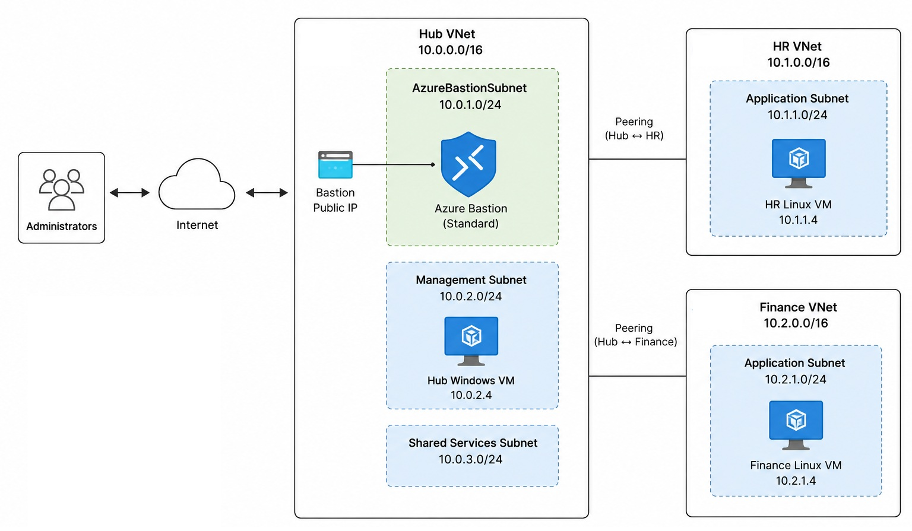

## 6.4 Deploy Azure Bastion

1) ### Create a Bastion Subnet in the Hub VNet

   The Bastion Host need to be deployed in a dedicated Bastion subnet in the VNet where it resides.

   So we create a Bastion Subnet first

   ```
   vnet-hub → Subnets → + Subnet
   ```

   Subnet IP range: **10.0.255.0/26**

   Subnet Name: **AzureBastionSubnet** (Can't be changed)

   > 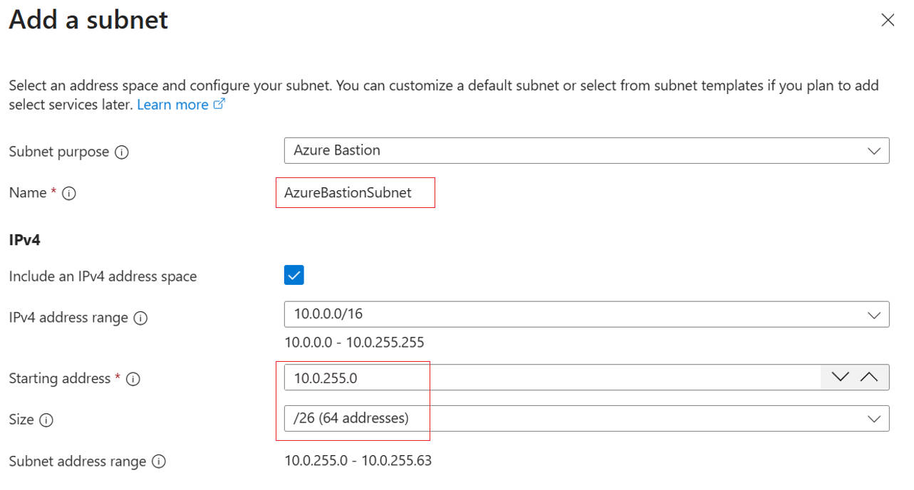

2) ### Create a Bastion Host in the subnet

    Name: bastion-hub  
    Tier: **Standard**  
    Virtual network: **vnet-hub**  
    Subnet: **AzureBastionSubnet ** 
    Public IP: **Create new** -> Public IP name: **pip-bastion-hub**  
    
	>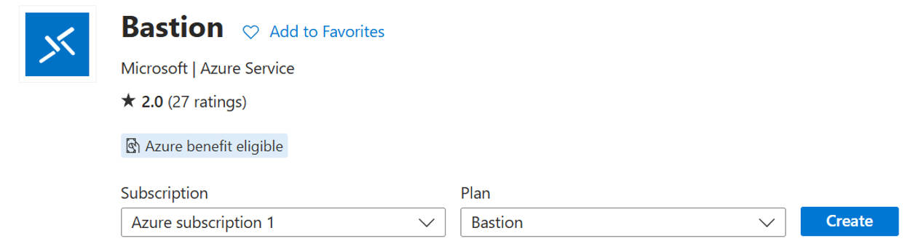

	>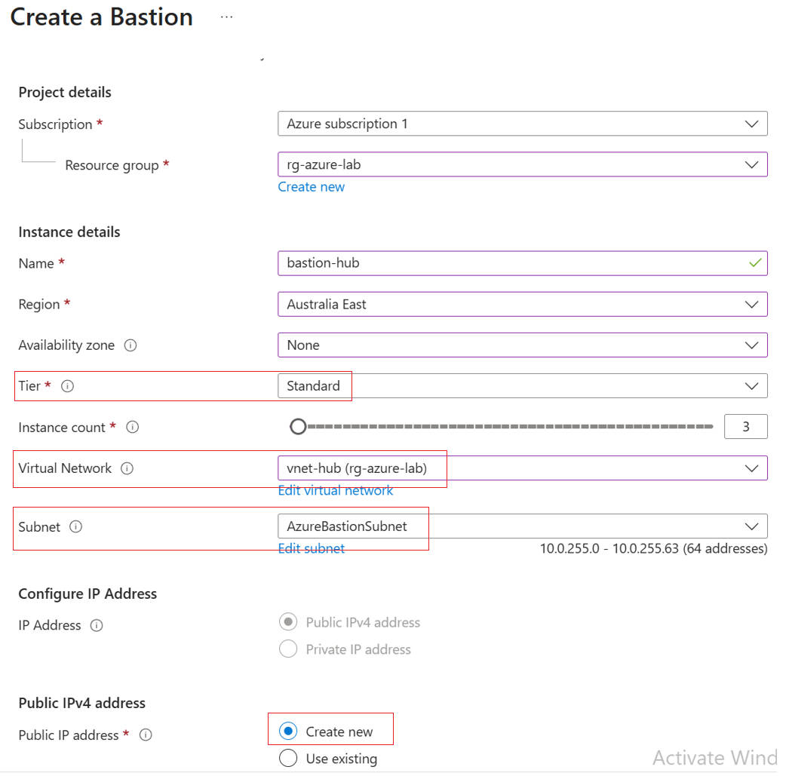

---

## 6.5 Configure Native Client

Azure Bastion supports both browser-based sessions and Native Client connections. 

Browser-based access launches an RDP or SSH session directly from the Azure portal.

Native Client allows administrators to use their preferred local applications such as:

- Windows Remote Desktop
- OpenSSH

Unlike Point-to-Site VPN, Azure Bastion does not require a dedicated client application. Instead, Native Client uses the  local RDP like Windows Remote Desktop or SSH client like OpenSSH together with Azure CLI to establish a secure connection through the Azure Bastion service.

Azure Bastion Native Client access is initiated using the Azure CLI **Bastion commands,** which is a extension of Azure CLI. The Bastion command acts as the connection tool. It communicates with the Azure Bastion service and then uses the local **RDP** or **SSH** client to establish the session to the target VM.

Azure CLI  
  └── Bastion command / extension  
        	├── az network bastion rdp  
        	└── az network bastion ssh  
              	↓
      	  Launch RDP / SSH client  

### Prerequisites

Before using Azure Bastion Native Client, the following requirements must be met.

For Windows VM

\- Remote Desktop (RDP) must be enabled.
\- Windows Firewall must allow RDP connections.

For Linux VM:

\- SSH service must be running.
\- SSH access must be permitted by the operating system firewall

In addition, the Network Security Group (NSG) associated with the virtual machine or subnet must allow the required management traffic from Azure Bastion.


1. ### Enable Native Client Support in Bastion Host

​	In order to use Native Client to make connection to Bastion is to enable the Native Client Support of Bastion Host. 

**Native Client Support**: Enabled

> 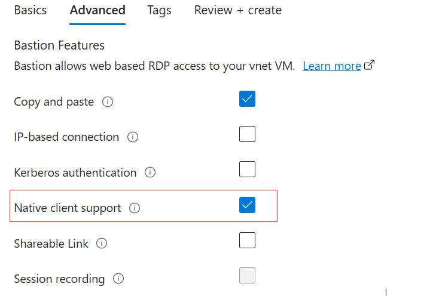

---

2. ### Find and copy the Resource ID of the Target VM from Azure Portal

   We need the resource ID of the target VM to make a bastion connection. So we go to Azure Portal to copy the VM resource ID

   ```
   VM -> Properties -> JSON: resource ID
   ```

   > 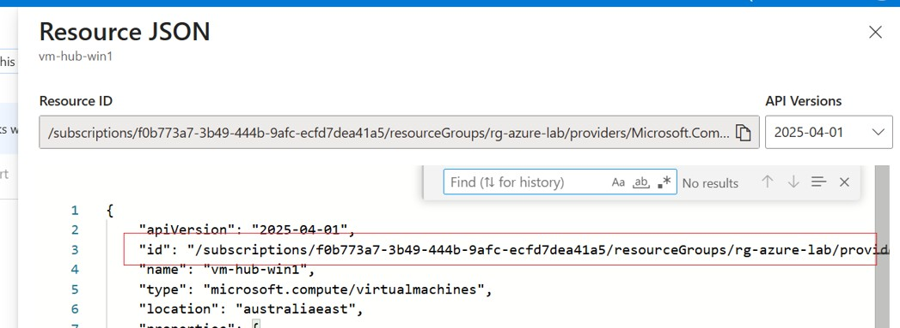


3. ### Launch Native client to make Bastion connection to target VM

​	For Linux VM, run the following command, using the vm's resource ID we just copied from Azure Portal

```
>az network bastion ssh `
--name "bastion-hub" `
--resource-group "rg-azure-lab" `
--target-resource-id "/subscriptions/f0b773a7-3b49-444b-9afc-ecfd7dea41a5/resourceGroups/rg-azure-lab/providers/Microsoft.Compute/virtualMachines/vm-finance-linux" `
--auth-type ssh-key `
--username "joe" `
--ssh-key "C:\Users\joest\Desktop\Lab-data\vm-linux-key.pem"
```

>

> 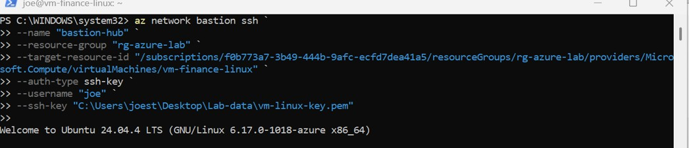


## 6.6 Upgrade VM Authentication to Entra ID Based

We used traditional authentication methods to sign-in the VM through Bastion

- Linux VM : SSH key authentication.

- Windows VM :  User name and password

This simplified the initial deployment while validating the network infrastructure. After Azure Bastion is operational, We upgrade the Anthentication method to Azure Entra ID for the following benifits

- Centralized identity management
- Multi-Factor Authentication (MFA)
- Azure RBAC integration
- No shared administrator passwords

---

### 1. Configure Windows Entra ID Sign-in

Requirements

- Azure AD Login-in Extension installed in the VM ( AADLoginForWindows )

- Enable Login with Microsoft Entra ID

- Enable Managed Identity of the VM

- Install the Azure AD Login Extension for the Windows VM

  

1) Install Azure AD Login-in Extension for Windows for the Windows VM
```
	VM settings-> Extensions + applications→ Add ->Azure AD Windows Login
```
  >


2. #### Enable Login with Entra ID

   ```
   In the properties of Windows VM -> tick Login with Microsoft Entra ID
   ```

   >

3. #### Enable Managed Identity of the VM

   ```
   VM -> Seettings -> Identity -> System Assigned: On
   ```

   >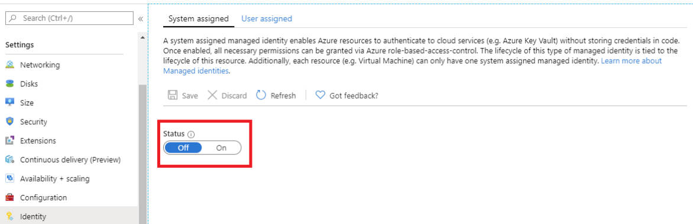

   

### 2. Configure Linux Entra ID Sign-in

Requirements

- Azure AD SSH Login-in Extension installed in the VM

- Enable VM Managed Identity

  1) Install Azure AD Login-in Extension for Windows for the Windows VM
  
  ```
  	VM settings-> Extensions + applications→ Add ->Azure AD SSH Login
  ```
  
  > 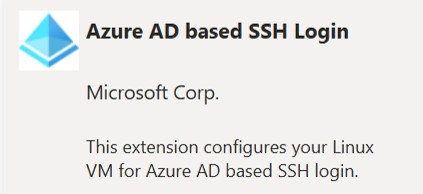>
  
  2. #### Enable Managed Identity of the VM
  
     ```
     VM -> Seettings -> Identity -> System Assigned: On
     ```
  
     > 
  
     

---

## 6.7 Assign VM RBAC Login role to users
1. ### VM Login Role

  Owner or Contributor permission does not automatically grant operating system login access to the Linux VM. The VM login role must be assigned separately.

So we assign to users either:

- Virtual Machine Administrator Login
- Virtual Machine User Login

for both Linux VM and Windows VM
```
VM → Access control (IAM) → Add role assignment → choose one the following roles
Virtual Machine Administrator Login
Virtual Machine user Login
```

>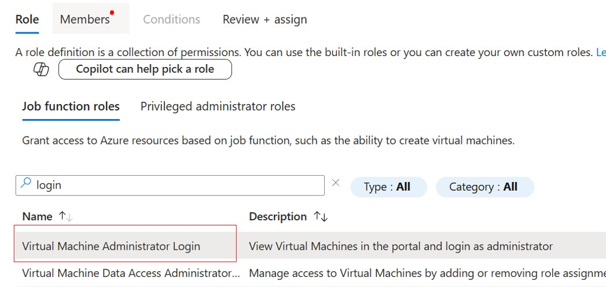

2. ### Other Roles

  In addition to assigning either the VM Login role, the follwing Azure RBAC permissions are also required for user login via Bastion Native client

  - **Reader** for the target VM, 

  - **Reader** for the Azure Bastion resource 

  - **Reader** for the VM network interface. 

​	These permissions allow Azure CLI to locate and access the Azure resources required to establish the 	Bastion connection. 


## 6.8 Connect Using Azure Bastion Native Client

The last step is to use **Bastion Connect command** to launch **Native client** to connect to the cloud VM via RDP for Windows or SSH for Linux

## Windows

```
az network bastion rdp `
  --name bastion-hub `
  --resource-group rg-azure-lab `
  --target-resource-id "/subscriptions/f0b773a7-3b49-444b-9afc-ecfd7dea41a5/resourceGroups/rg-azure-lab/providers/Microsoft.Compute/virtualMachines/vm-hub-win" `
  --enable-mfa
```

> 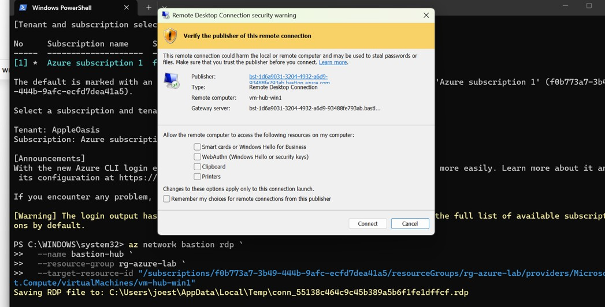


When the Authentication Window appears, input your Entra ID credentials to sign in
> 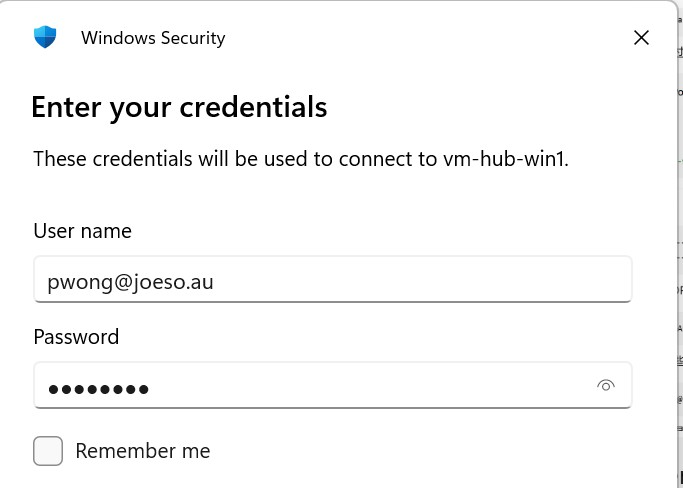

---

## Linux

```
az network bastion ssh `
--name bastion-hub `
--resource-group rg-azure-lab `
--target-resource-id "/subscriptions/f0b773a7-3b49-444b-9afc-ecfd7dea41a5/resourceGroups/rg-azure-lab/providers/Microsoft.Compute/virtualMachines/vm-hr-linux1" `
--auth-type aad
```
>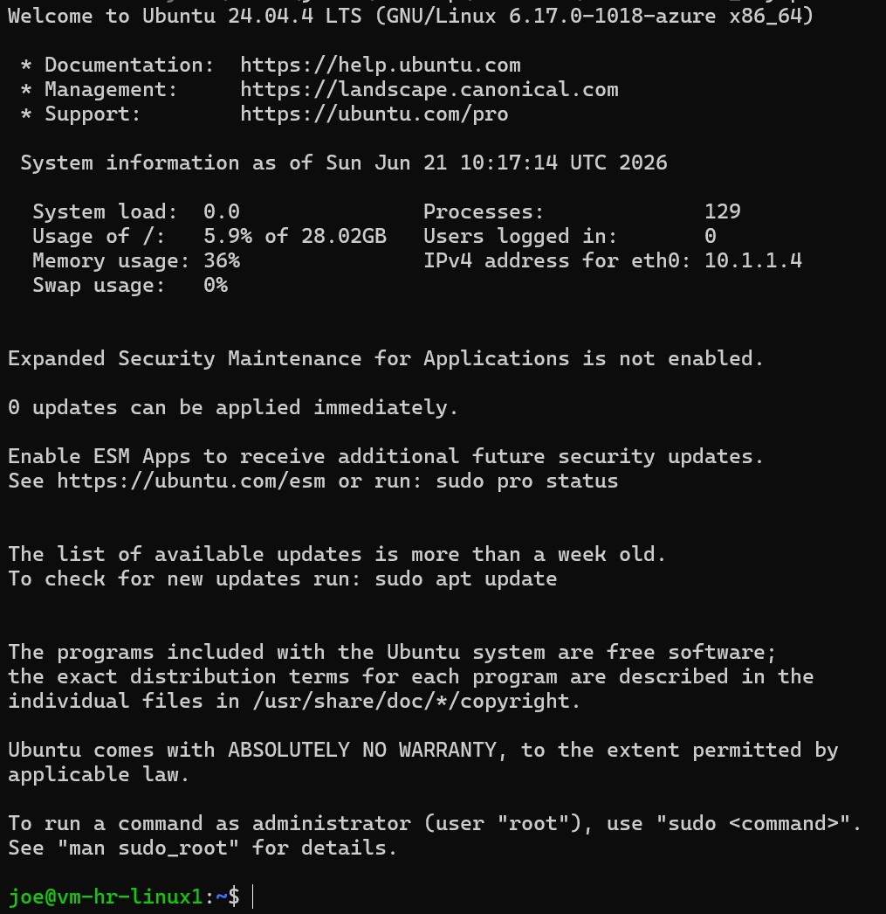

---

# Summary

This lab the VM deployed Bastion Service and accomplished the remote access to Hub and Spoke cloud VMs with Bastion Native client and Entra ID authentication.

During the implementation, several configuration dependencies were identified. Successful Microsoft Entra ID sign-in required more than simply enabling the feature on the virtual machine. Managed Identity, VM extensions, Azure RBAC assignments and additional Reader permissions were all required before Azure Bastion Native Client could establish a connection successfully.

Another key takeaway was understanding the difference between Point-to-Site VPN and Azure Bastion. While both provide secure remote access, Point-to-Site VPN extends the Azure network to the administrator's computer, while Azure Bastion provides secure administrative access to individual VMs without requiring VPN connectivity or public IP addresses.

Together with the Hub-Spoke architecture, Azure Firewall and VPN connectivity implemented in previous chapters, Azure Bastion completes a secure remote administration solution that resembles an enterprise Azure environment.
