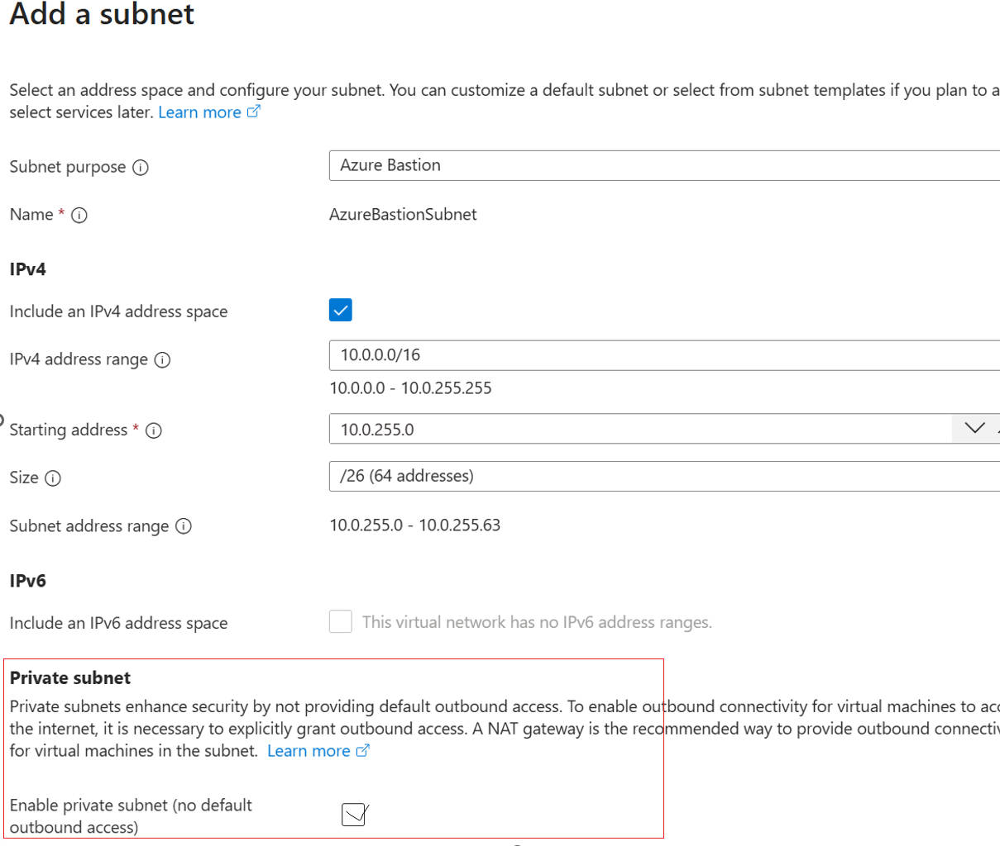
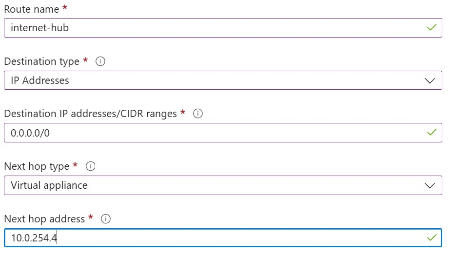
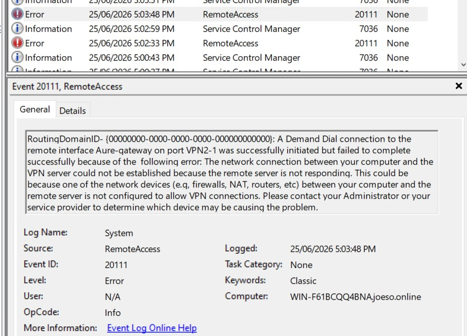
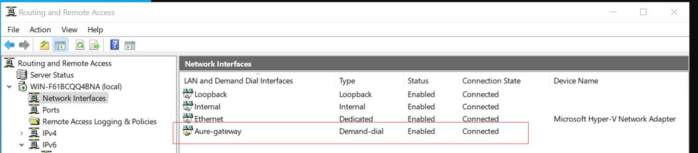
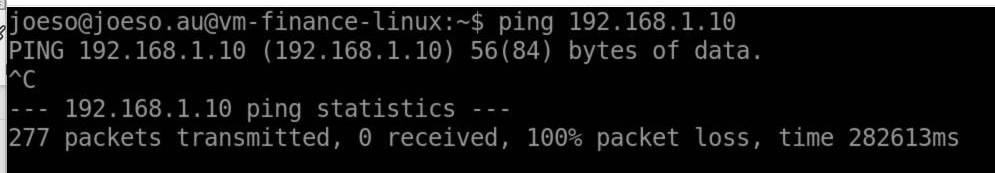
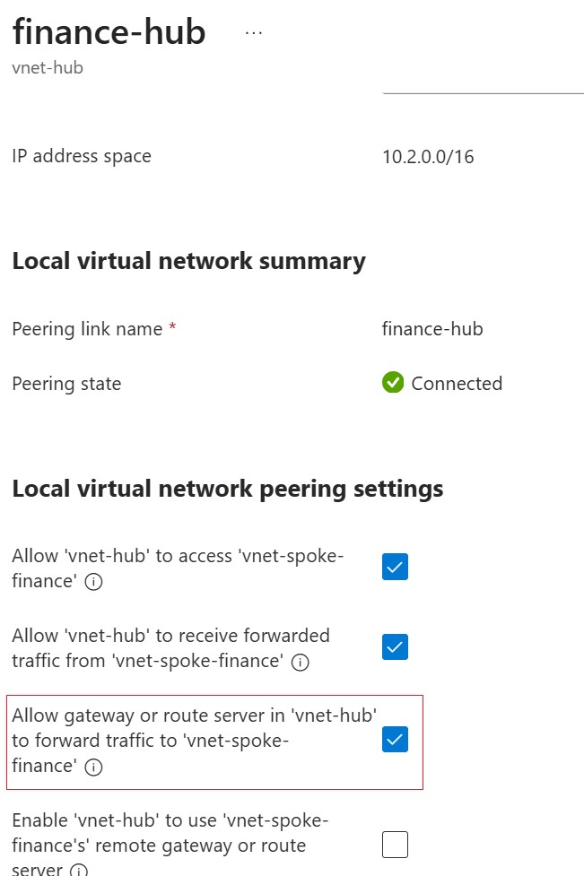
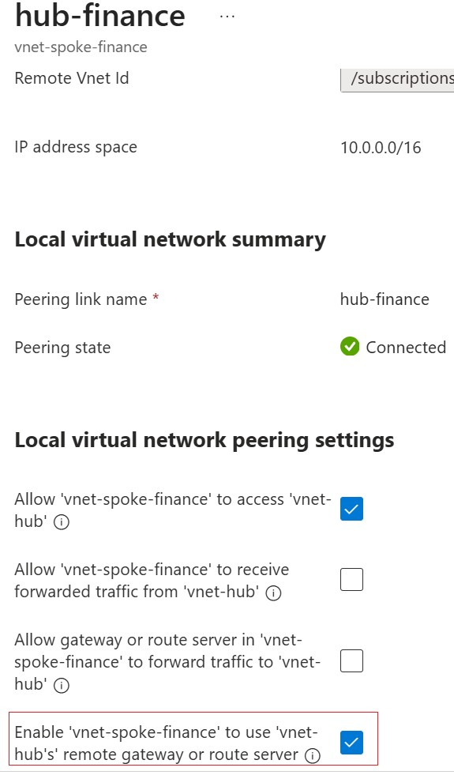
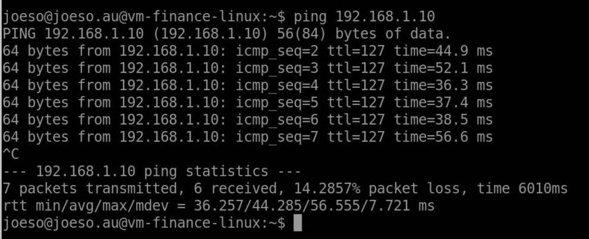

# 7 Troubleshooting

## 7.1 Private Subnet Prevented VM Extension Installation

### Issue

When we attempted to install VM Azure AD Login extension for VM in the Spoke Vnet, it continued to failed.

### Investigation and Resolution

The extension logs showed repeated connection timeouts while attempting to download packages from Microsoft and Ubuntu repositories. The problem was not related to Microsoft Entra ID itself, but to the lack of outbound Internet connectivity.

Then we found The subnet of the VM was set to be a "**Private Subnet**" for security reason. . However, a private subnet means it has no internet access and the VM can't download the extension without internet access. 

> 

To resolve this issue, we temporarily disable the private subnet for the VM subnet. After outbound Internet access was restored:

- The Extension package repositories became reachable.
- The Microsoft Entra ID  extension installed successfully.

The VM will get secured internet access after configure Hub-Spoke+firewall networking infrastruction. The temporary Internet outbound access will be closed after that.

### Lesson Learned

Security features should be implemented in the correct order. Some Azure services, such as VM extensions, require temporary outbound Internet access during deployment. Once the environment is fully configured with Azure Firewall and centralized outbound routing, direct Internet access can be closed 

---

## 7.2 Azure Bastion Native Client Required Additional RBAC Permissions

### Issue

When use Bastion Native command to connect to cloud VMs, Microsoft Entra ID authentication continued to fail even after assigning the **Virtual Machine Administrator Login** role.

Azure CLI returned the following authorization errors 

> 

### Investigation and Resolution

To sign-in cloud VMs, a user need the following extra roles apart from the Login role

- **Reader** for the target VM,
- **Reader** for the Azure Bastion resource
- **Reader** for the VM network interface.

The VM login role only grants operating system sign-in permission. Azure Bastion Native Client also needs the above permission to read several Azure resources before establishing the session. After all the roles above assigned to the user, the use can sign in the VM

> 

### Lesson Learned

Microsoft Entra authentication depends on both operating system login permissions and Azure resource permissions. Following the least privilege principle provides sufficient access without unnecessary  rights.

---

## 7.3 Bastion Connection to Windows VM Failed due to VM Entra ID Join Status

### Issue

When tried to use Bastion Native client to connect Windows VM using Entra ID user, who has been assigned the login role, but still failed to log in the Windows VM.

### Investigation and Resolution

Running from Windows VM

```powershell
dsregcmd /status
```

showed:

```
AzureAdJoined : NO
```

> 

Installing the **AADLoginForWindows** extension alone does not automatically join the virtual machine to Microsoft Entra ID.

Using Entra ID authentication method to login the VM, the VM need to be Entra Join, or selected "Log with Microsoft Entra ID" when creating the Windows VM.

So we recreated the Windows VM with **Login with Microsoft Entra ID** enabled.

This automatically enabled the required system-assigned managed identity and allowed Microsoft Entra authentication to work correctly.

> 

### Lesson Learned

**Login with Microsoft Entra ID** must be enabled during VM deployment if we need to use Entra ID authentication for VM sign-in

---

## 7.4 Azure Firewall Rules Not Working

### Issue

Firewall rules appeared to have no effect even though the rules were correctly configured.

### Investigation and Resolution

The reason is the traffic was still using Azure system routes instead of passing through Azure Firewall. 

WE need to configure User Defined Routes (UDRs)  to redirect the required traffic to the Azure Firewall private IP address.

> 

### Lesson Learned

Azure Firewall only inspects traffic that is explicitly routed through it. Correct firewall rules alone are not sufficient; routing must also be configured correctly.

---

## 7.5 On-premises VPN Router Could Not Establish IKE Negotiation

### Issue

The original design of the VPN lab was to use the on-prem VPN hardware router **TP-Link TL-R473G** as the Site-to-Site IPSec VPN endpoint connecting directly to the Azure VPN Gateway. However, despite multiple configuration attempts, the VPN tunnel could not be established successfully.

### Investigation and Resolution

Although the Azure VPN Gateway was fully deployed and configured, the VPN router showed no incoming VPN connection attempts. This indicated that the IKE negotiation was not even starting, so it was unlikely that the issue was caused by authentication or IPsec settings. After verifying the public IP address, shared key, the router still failed to establish the IPsec stage 1 VPN negotiation.

Rather than continuing to use the router,  I changed to use Windows Server 2022 RRAS  as the on-prem VPN endpoint. After configuring RRAS with compatible IPsec/IKE settings, the Site-to-Site VPN tunnel was established successfully.

### Lesson Learned

Not all VPN devices provide the same level of compatibility with Azure VPN Gateway. Before selecting a VPN appliance for production, it is important to verify that the device is officially supported and capable of meeting Azure VPN requirements.

---

## 7.6 Site-to-Site VPN Failed Due to VPN Protocol Mismatch

### Issue

After changing the On-prem endpoint to Windows Server 2022 RRAS, we found the Site-to-Site VPN tunnel could not be established after the configuration. Windows RRAS repeatedly generated **RemoteAccess Event ID 20111**, indicating that the VPN server was not responding.

> 

### Investigation and Resolution

After investigation, I found that the VPN protocols configured on each side were different.

- Windows RRAS was configured to use **IKEv2**
- Azure VPN Gateway connection was configured to use **IKEv1**

Because both VPN endpoints must negotiate using the same IKE protocol, the tunnel negotiation failed before the IPsec connection can be established.

To solve this issue, I change the VPN protocol on Azure Gateway to **IKEv2**. After both VPN endpoints were configured with the same IKE version, the Site-to-Site VPN tunnel was successfully established.

> 


### Lesson Learned

When troubleshooting Site-to-Site VPN connectivity, always verify that both VPN endpoints are using compatible VPN protocols and parameters.

---

## 7.7 On-prem Network Could Not Reach Spoke Virtual Machines

### Issue

After the Site-to-Site VPN tunnel was successfully established, the on-prem Windows RRAS Server was unable to reach VMs located in the Spoke VNets.

> 

### Investigation and Resolution

The VPN tunnel was working correctly, indicating that the problem was not related to VPN connectivity.

Further investigation showed that although the Hub and Spoke VNets were already peered, the peering configuration had not been configured to allow the spoke VNets to use the Hub VPN Gateway. We need to enable Gateway transit in the peering settings

- **Hub VNet:** Allow gateway transit

- **Spoke VNet:** Use remote gateway

  >

  >

After configured the gateway transit of peering , the on-prem network can  communicate with VM in spoke VNets.

  >

### Lesson Learned

VNet peering alone does not automatically allow spoke VNets to use a VPN Gateway located in the Hub VNet. Gateway Transit must be configured on both sides of the peering.


## 7.8 Network Changes Required VM Deallocation

### Issue

Certain networking changes appeared to have no effect even after rebooting the virtual machine.

### Resolution

Stopping (Deallocate) and restarting the VM forced Azure to recreate the underlying compute resources and refresh the networking configuration. A normal operating system reboot was not sufficient.

### Lesson Learned

Some Azure infrastructure changes take place outside the operating system. Deallocating the VM should be considered when network configuration changes seems not to take effect.
