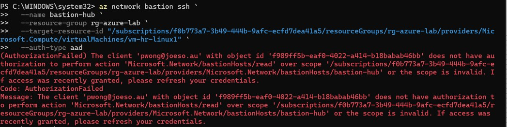
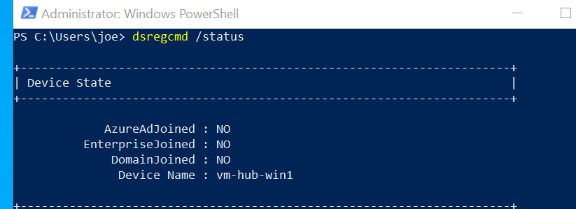
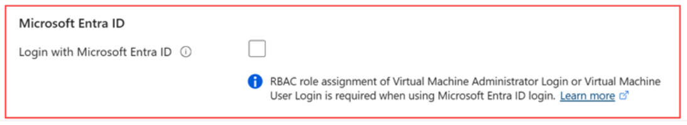

# 07 Troubleshooting


## Private Subnet Prevented VM Extension Installation

### Issue

The Linux virtual machine was deployed without a Public IP inside a private subnet. Although Azure Bastion could successfully establish an SSH session, installing the Microsoft Entra ID SSH extension repeatedly failed.

### Investigation

The extension logs showed repeated connection timeouts while attempting to download packages from Microsoft and Ubuntu repositories.

The problem was not related to Microsoft Entra ID itself, but to the lack of outbound Internet connectivity.

### Resolution

A NAT Gateway was deployed and associated with the application subnet.

After outbound Internet access was restored:

- Linux package repositories became reachable.
- `apt update` completed successfully.
- The Microsoft Entra ID SSH extension installed successfully.

### Lesson Learned

Removing Public IP addresses does not eliminate the need for outbound Internet access. Private virtual machines still require controlled outbound connectivity for operating system updates, VM extensions, monitoring agents and package installation.

---

## Azure Bastion Native Client Required Additional RBAC Permissions

### Issue

When use Bastion Native command to connect to cloud VMs, Microsoft Entra ID authentication continued to fail even after assigning the **Virtual Machine Administrator Login** role.

Azure CLI returned the following authorization errors 

> 

### Investigation and Resolution

To sign-in cloud VMs, a user need the following extra roles apart from the Login role

- **Reader** for the target VM,
- **Reader** for the Azure Bastion resource
- **Reader** for the VM network interface.

The VM login role only grants operating system sign-in permission. Azure Bastion Native Client also needs the above permission to read several Azure resources before establishing the session. After all the roles above assigned to the user, the use can sign in the VM

> 

---

## Microsoft Entra ID Sign-in for Windows Required VM Recreation

### Issue

When tried to use Bastion Native client to connect Windows VM using Entra ID user, who has been assigned the login role, but still failed to log in the Windows VM.

### Investigation and Resolution

Running from Windows VM

```powershell
dsregcmd /status
```

showed:

```
AzureAdJoined : NO
```

> 

Installing the **AADLoginForWindows** extension alone does not automatically join the virtual machine to Microsoft Entra ID.

Using Entra ID authentication method to login the VM, the VM need to be Entra Join, or selected "Log with Microsoft Entra ID" when creating the Windows VM.

So we recreated the Windows VM with **Login with Microsoft Entra ID** enabled.

This automatically enabled the required system-assigned managed identity and allowed Microsoft Entra authentication to work correctly.

> 

### Lesson Learned

Some Azure features must be enabled during VM deployment. Recreating the VM was simpler and more reliable than attempting to retrofit the configuration afterwards.

---

## 4. Network Changes Required VM Deallocation

### Issue

Certain networking changes appeared to have no effect even after rebooting the virtual machine.

### Resolution

Stopping (Deallocate) and starting the virtual machine forced Azure to recreate the underlying compute resources and refresh the networking configuration.

A normal operating system reboot was not sufficient.

### Lesson Learned

Some Azure infrastructure changes occur outside the guest operating system. Deallocating the VM should be considered when network configuration changes do not appear to take effect.

---

## 5. Azure Bastion Native Client Simplified Microsoft Entra Authentication

### Issue

Traditional Microsoft Entra RDP authentication normally requires the administrator workstation to be Microsoft Entra joined or Hybrid joined.

### Resolution

Azure Bastion Native Client supports modern browser-based authentication by using the `--enable-mfa` parameter.

This allowed Microsoft Entra authentication without requiring the administrator's local computer to be Microsoft Entra joined.

### Lesson Learned

Azure Bastion Native Client simplifies secure remote administration while maintaining Microsoft Entra authentication and multi-factor authentication.

---

## 6. Site-to-Site VPN Required Systematic Troubleshooting

### Issue

The Site-to-Site VPN tunnel remained disconnected after deployment.

### Investigation

Instead of changing multiple settings simultaneously, each possible cause was verified individually, including:

- Azure VPN Gateway deployment
- Local Network Gateway configuration
- Public IP address
- Shared key
- UDP 500 connectivity
- VPN router listener
- IPsec/IKE configuration

The issue was eventually traced to IPsec proposal compatibility between Azure VPN Gateway and the on-premises VPN router.

### Resolution

The VPN router was reconfigured to use supported Phase 1 and Phase 2 algorithms compatible with Azure VPN Gateway.

The tunnel established successfully afterwards.

### Lesson Learned

A structured troubleshooting process is often more effective than repeatedly modifying multiple settings without identifying the actual root cause.

---

## 7. NAT Gateway Cannot Be Shared Across Peered VNets

### Issue

Initially, it was assumed that a single NAT Gateway in the Hub VNet could provide outbound Internet access for all peered spoke VNets.

### Investigation

NAT Gateway is associated with individual subnets and cannot be shared through VNet Peering.

### Resolution

The lab architecture was updated to use Azure Firewall as the centralized outbound Internet gateway for all spoke VNets.

User Defined Routes (UDRs) redirected outbound traffic from each spoke to the Azure Firewall.

### Lesson Learned

For enterprise Hub-Spoke architectures, centralized outbound Internet access is typically implemented with Azure Firewall rather than a shared NAT Gateway.

---

# Summary

This project involved considerably more troubleshooting than initially expected. Most issues were not caused by incorrect configuration, but by understanding how different Azure services interact, including networking, identity, routing and permissions.

The experience gained from diagnosing and resolving these problems provided a much deeper understanding of Azure than simply following deployment guides. More importantly, it reinforced the importance of systematic troubleshooting, verifying assumptions, and isolating problems one component at a time when building enterprise cloud environments.